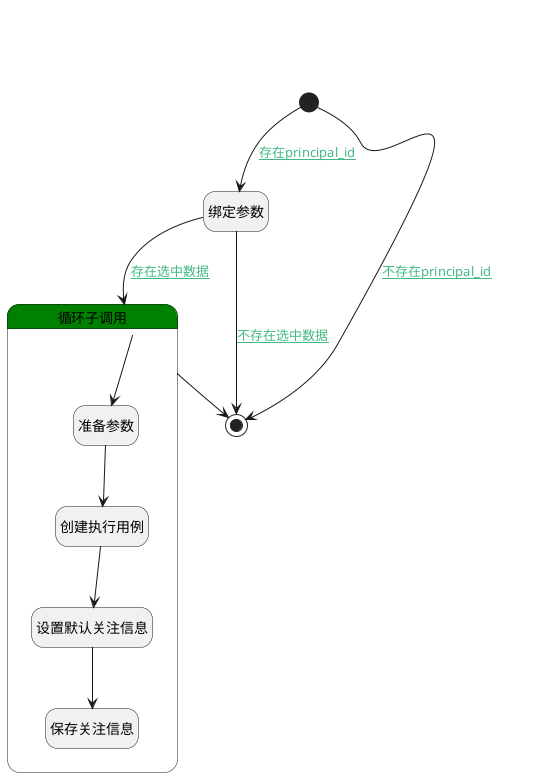

## 规划计划 <!-- {docsify-ignore-all} -->

   将测试用例规划进测试计划内，生成执行用例

### 处理过程

### 处理步骤说明

#### 开始 :id=Begin [开始]

*- N/A*
#### 绑定参数 :id=BINDPARAM1 [绑定参数]

绑定参数`Default(传入变量)` 到 `selectdata(关联列表)`
#### 循环子调用 :id=LOOPSUBCALL1 [循环子调用]

循环参数`selectdata(关联列表)`，子循环参数使用`for_temp_obj(循环临时变量)`
#### 准备参数 :id=PREPAREPARAM1 [准备参数]

1. 将`for_temp_obj(循环临时变量)` 拷贝到  `select_create_data(需创建的数据)`

#### 创建执行用例 :id=DEACTION1 [实体行为]

调用实体 [执行用例(RUN)](module/TestMgmt/run.md) 行为 [Create](module/TestMgmt/run#行为) ，行为参数为`select_create_data(需创建的数据)`

#### 设置默认关注信息 :id=PREPAREPARAM2 [准备参数]

1. 将`select_create_data(需创建的数据).ID(标识)` 设置给  `attention_info(关注人信息).OWNER_ID(所属数据标识)`
2. 将`用户全局对象.srfpersonname` 设置给  `attention_info(关注人信息).NAME(名称)`
3. 将`select_create_data(需创建的数据).CREATE_MAN(建立人)` 设置给  `attention_info(关注人信息).USER_ID(关注人)`
4. 将`RUN` 设置给  `attention_info(关注人信息).OWNER_SUBTYPE(所属对象子类型)`
5. 将`RUN` 设置给  `attention_info(关注人信息).OWNER_TYPE(所属数据对象)`
6. 将`40` 设置给  `attention_info(关注人信息).TYPE(关注类型)`

#### 保存关注信息 :id=DEACTION2 [实体行为]

调用实体 [关注(ATTENTION)](module/Base/attention.md) 行为 [Save](module/Base/attention#行为) ，行为参数为`attention_info(关注人信息)`

#### 结束 :id=END1 [结束]

*- N/A*

### 连接条件说明
#### 存在principal_id :id=Begin-BINDPARAM1

`Default(传入变量).principal_id` ISNOTNULL
#### 不存在选中数据 :id=BINDPARAM1-END1

`selectdata(关联列表).size` EQ `0`
#### 存在选中数据 :id=BINDPARAM1-LOOPSUBCALL1

`selectdata(关联列表).size` NOTEQ `0`
#### 不存在principal_id :id=Begin-END1

`Default(传入变量).principal_id` ISNULL

### 实体逻辑参数

|    中文名   |    代码名    |  数据类型    |  实体   |备注 |
| --------| --------| -------- | -------- | --------   |
|传入变量(<i class="fa fa-check"/></i>)|Default|数据对象|[用例(TEST_CASE)](module/TestMgmt/test_case.md)||
|关注人信息|attention_info|数据对象|[关注(ATTENTION)](module/Base/attention.md)||
|循环临时变量|for_temp_obj|数据对象|[用例(TEST_CASE)](module/TestMgmt/test_case.md)||
|关系对象|relationobj|数据对象|[关联(RELATION)](module/Base/relation.md)||
|反向关系对象|relationobj2|数据对象|[关联(RELATION)](module/Base/relation.md)||
|需创建的数据|select_create_data|数据对象|[用例(TEST_CASE)](module/TestMgmt/test_case.md)||
|关联列表|selectdata|数据对象列表|[用例(TEST_CASE)](module/TestMgmt/test_case.md)||
