## 恢复 <!-- {docsify-ignore-all} -->

   恢复已删除状态测试用例数据，修改测试用例的是否删除属性值，并恢复访问记录

### 处理过程

```plantuml
@startuml
hide empty description
<style>
root {
  HyperlinkColor #42b983
}
</style>

hide empty description
state "开始" as Begin <<start>> [[$./recover#begin {"开始"}]]
state "设置删除状态" as PREPAREPARAM1  [[$./recover#prepareparam1 {"设置删除状态"}]]
state "更新删除状态" as DEACTION1  [[$./recover#deaction1 {"更新删除状态"}]]
state "恢复最近访问" as RAWSQLCALL1  [[$./recover#rawsqlcall1 {"恢复最近访问"}]]
state "结束" as END1 <<end>> [[$./recover#end1 {"结束"}]]


Begin --> PREPAREPARAM1
PREPAREPARAM1 --> DEACTION1
DEACTION1 --> RAWSQLCALL1
RAWSQLCALL1 --> END1


@enduml
```




### 处理步骤说明

#### 开始 :id=Begin<sup class="footnote-symbol"> <font color=gray size=1>[开始]</font></sup>


*- N/A*
#### 设置删除状态 :id=PREPAREPARAM1<sup class="footnote-symbol"> <font color=gray size=1>[准备参数]</font></sup>


1. 将`0` 设置给  `Default(传入变量).IS_DELETED(是否已删除)`

#### 更新删除状态 :id=DEACTION1<sup class="footnote-symbol"> <font color=gray size=1>[实体行为]</font></sup>


调用实体 [用例(TEST_CASE)](module/TestMgmt/test_case.md) 行为 [Update](module/TestMgmt/test_case#行为) ，行为参数为`Default(传入变量)`

#### 恢复最近访问 :id=RAWSQLCALL1<sup class="footnote-symbol"> <font color=gray size=1>[直接SQL调用]</font></sup>

update recent set IS_DELETED=0 where owner_id=? and owner_subtype='test_case'

<p class="panel-title"><b>执行sql语句</b></p>

```sql
update recent set IS_DELETED=0 where owner_id=? and owner_subtype='test_case'
```

<p class="panel-title"><b>执行sql参数</b></p>

1. `Default(传入变量).ID(标识)`


#### 结束 :id=END1<sup class="footnote-symbol"> <font color=gray size=1>[结束]</font></sup>


*- N/A*


### 实体逻辑参数

|    中文名   |    代码名    |  数据类型    |  实体   |备注 |
| --------| --------| -------- | -------- | --------   |
|传入变量(<i class="fa fa-check"/></i>)|Default|数据对象|[用例(TEST_CASE)](module/TestMgmt/test_case.md)||
