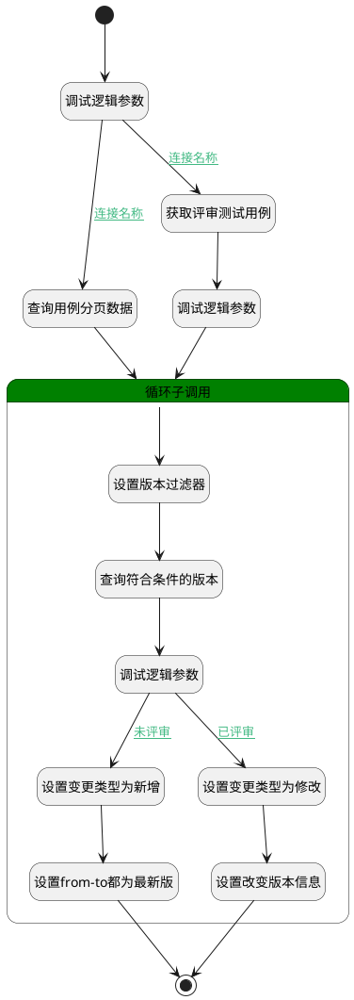

## 获取变更类型与变更版本 <!-- {docsify-ignore-all} -->

   获取测试用例变更类型与变更版本

### 处理过程




### 处理步骤说明

#### 开始 :id=Begin<sup class="footnote-symbol"> <font color=gray size=1>[开始]</font></sup>


*- N/A*
#### 调试逻辑参数 :id=DEBUGPARAM3<sup class="footnote-symbol"> <font color=gray size=1>[调试逻辑参数]</font></sup>


> [!NOTE|label:调试信息|icon:fa fa-bug]
> 调试输出参数`Default(传入变量)`的详细信息


#### 查询用例分页数据 :id=DEDATASET1<sup class="footnote-symbol"> <font color=gray size=1>[实体数据集]</font></sup>


调用实体 [用例(TEST_CASE)](module/TestMgmt/test_case.md) 数据集合 [正常状态(normal)](module/TestMgmt/test_case#数据集合) ，查询参数为`Default(传入变量)`

将执行结果返回给参数`page_results(分页查询结果)`

#### 循环子调用 :id=LOOPSUBCALL1<sup class="footnote-symbol"> <font color=gray size=1>[循环子调用]</font></sup>


循环参数`page_results(分页查询结果)`，子循环参数使用`for_obj(循环临时变量)`
#### 调试逻辑参数 :id=DEBUGPARAM4<sup class="footnote-symbol"> <font color=gray size=1>[调试逻辑参数]</font></sup>


> [!NOTE|label:调试信息|icon:fa fa-bug]
> 调试输出参数`page_results(分页查询结果)`的详细信息


#### 设置版本过滤器 :id=PREPAREPARAM1<sup class="footnote-symbol"> <font color=gray size=1>[准备参数]</font></sup>


1. 将`for_obj(循环临时变量).ID(标识)` 设置给  `version_filter(版本过滤器).N_OWNER_ID_EQ`
2. 将`2` 设置给  `version_filter(版本过滤器).SIZE`

#### 获取评审测试用例 :id=RAWSQLCALL1<sup class="footnote-symbol"> <font color=gray size=1>[直接SQL调用]</font></sup>


<p class="panel-title"><b>执行sql语句</b></p>

```sql
	SELECT
		* 
	FROM
		test_case t1 
	WHERE
		NOT EXISTS (
		SELECT
			* 
		FROM
			relation t2
			JOIN review_content_extend t3 ON t3.id = t2.id
			JOIN review t4 ON t4.id = t2.PRINCIPAL_ID 
		WHERE
			t2.TARGET_ID = t1.id 
			AND t4.id = ? 
		) 
		AND t1.TEST_LIBRARY_ID = ?  AND t1.IS_DELETED = 0
	ORDER BY
	t1.IDENTIFIER;
```

<p class="panel-title"><b>执行sql参数</b></p>

1. `Default(传入变量).review`
2. `Default(传入变量).n_test_library_id_eq`

重置参数`page_results(分页查询结果)`，并将执行sql结果赋值给参数`page_results(分页查询结果)`

#### 查询符合条件的版本 :id=DEDATASET2<sup class="footnote-symbol"> <font color=gray size=1>[实体数据集]</font></sup>


调用实体 [版本(VERSION)](module/Base/version.md) 数据集合 [数据集(DEFAULT)](module/Base/version#数据集合) ，查询参数为`version_filter(版本过滤器)`

将执行结果返回给参数`version_pages_results(版本分页结果)`

#### 调试逻辑参数 :id=DEBUGPARAM2<sup class="footnote-symbol"> <font color=gray size=1>[调试逻辑参数]</font></sup>


> [!NOTE|label:调试信息|icon:fa fa-bug]
> 调试输出参数`for_obj(循环临时变量)`的详细信息


#### 设置变更类型为新增 :id=PREPAREPARAM2<sup class="footnote-symbol"> <font color=gray size=1>[准备参数]</font></sup>


1. 将`0` 设置给  `for_obj(循环临时变量).change_type`

#### 设置变更类型为修改 :id=PREPAREPARAM3<sup class="footnote-symbol"> <font color=gray size=1>[准备参数]</font></sup>


1. 将`1` 设置给  `for_obj(循环临时变量).change_type`

#### 设置from-to都为最新版 :id=RAWSFCODE1<sup class="footnote-symbol"> <font color=gray size=1>[直接后台代码]</font></sup>

设置from-to都为最新版

<p class="panel-title"><b>执行代码[JavaScript]</b></p>

```javascript
var version_pages_results = logic.getParam("version_pages_results");

if (version_pages_results) {
    var change_version = {};
    var for_obj = logic.getParam("for_obj");
    for (var i = 0; i < version_pages_results.length; i++) {
        //新增只有to
        if (i === 0) {
            change_version["to"] = version_pages_results.get(i);
        }
    }

    for_obj.set("change_version", change_version);
}
```

#### 设置改变版本信息 :id=RAWSFCODE2<sup class="footnote-symbol"> <font color=gray size=1>[直接后台代码]</font></sup>


<p class="panel-title"><b>执行代码[JavaScript]</b></p>

```javascript
var version_pages_results = logic.getParam("version_pages_results");
if (version_pages_results) {
    var change_version = {};
    var for_obj = logic.getParam("for_obj");
    for (var i = 0; i < version_pages_results.length; i++) {
        if (i === 0) {
            change_version["from"] = version_pages_results.get(i);
            change_version["to"] = version_pages_results.get(i);
            sys.info("进入1");
        } else if (i === 1) {
            change_version["from"] = version_pages_results.get(i);
            sys.info("进入2");
        }
    }
    for_obj.set("change_version", change_version);}
```

#### 结束 :id=END1<sup class="footnote-symbol"> <font color=gray size=1>[结束]</font></sup>


返回 `page_results(分页查询结果)`


### 连接条件说明
#### 连接名称 :id=DEBUGPARAM3-DEDATASET1

`Default(传入变量).review` ISNULL
#### 未评审 :id=DEBUGPARAM2-PREPAREPARAM2

`for_obj(循环临时变量).REVIEW_RESULT_STATE(评审结果)` EQ `1`
#### 已评审 :id=DEBUGPARAM2-PREPAREPARAM3

`for_obj(循环临时变量).REVIEW_RESULT_STATE(评审结果)` NOTEQ `1`
#### 连接名称 :id=DEBUGPARAM3-RAWSQLCALL1

`Default(传入变量).review` ISNOTNULL


### 实体逻辑参数

|    中文名   |    代码名    |  数据类型    |  实体   |备注 |
| --------| --------| -------- | -------- | --------   |
|传入变量(<i class="fa fa-check"/></i>)|Default|过滤器|||
|变更版本|change_version|数据对象|||
|循环临时变量|for_obj|数据对象|[用例(TEST_CASE)](module/TestMgmt/test_case.md)||
|分页查询结果|page_results|分页查询|||
|评审详情|review_detail|数据对象|[评审(REVIEW)](module/TestMgmt/review.md)||
|版本过滤器|version_filter|过滤器|||
|版本分页结果|version_pages_results|分页查询|||
