## 测试用例活动情况 <!-- {docsify-ignore-all} -->

   报表测试用例活动情况数据源

### 处理过程

```plantuml
@startuml
hide empty description
<style>
root {
  HyperlinkColor #42b983
}
</style>

hide empty description
state "开始" as Begin <<start>> [[$./test_case_maneuver_context#begin {"开始"}]]
state "结束" as END1 <<end>> [[$./test_case_maneuver_context#end1 {"结束"}]]
state "直接SQL调用" as RAWSQLCALL1  [[$./test_case_maneuver_context#rawsqlcall1 {"直接SQL调用"}]]


Begin --> RAWSQLCALL1
RAWSQLCALL1 --> END1


@enduml
```




### 处理步骤说明

#### 开始 :id=Begin<sup class="footnote-symbol"> <font color=gray size=1>[开始]</font></sup>


*- N/A*
#### 结束 :id=END1<sup class="footnote-symbol"> <font color=gray size=1>[结束]</font></sup>


返回 `result(结果)`

#### 直接SQL调用 :id=RAWSQLCALL1<sup class="footnote-symbol"> <font color=gray size=1>[直接SQL调用]</font></sup>


<p class="panel-title"><b>执行sql语句</b></p>

```sql
SELECT
    date_series.date AS filter_type,
    COALESCE(new_cases.count, 0) AS new_count, -- 每日新增测试用例数量
    COALESCE(updated_cases.count, 0) AS updated_count -- 每日修改测试用例数量
FROM (
         SELECT DATE_ADD(?, INTERVAL seq.seq DAY) AS date
         FROM (
                  SELECT a.i+b.i*10+c.i*100 AS seq
                  FROM (SELECT 0 AS i UNION SELECT 1 UNION SELECT 2 UNION SELECT 3 UNION SELECT 4 UNION SELECT 5 UNION SELECT 6 UNION SELECT 7 UNION SELECT 8 UNION SELECT 9) a,
                       (SELECT 0 AS i UNION SELECT 1 UNION SELECT 2 UNION SELECT 3 UNION SELECT 4 UNION SELECT 5 UNION SELECT 6 UNION SELECT 7 UNION SELECT 8 UNION SELECT 9) b,
                       (SELECT 0 AS i UNION SELECT 1 UNION SELECT 2 UNION SELECT 3 UNION SELECT 4 UNION SELECT 5 UNION SELECT 6 UNION SELECT 7 UNION SELECT 8 UNION SELECT 9) c
              ) seq
         WHERE DATE_ADD(?, INTERVAL seq.seq DAY) BETWEEN ? AND ?
     ) date_series
         LEFT JOIN (
    SELECT
        DATE(CREATE_TIME) AS date,
        COUNT(*) AS count
    FROM TEST_CASE
    WHERE TEST_LIBRARY_ID = ? AND CREATE_TIME BETWEEN ? AND ?
    GROUP BY DATE(CREATE_TIME)
) new_cases ON date_series.date = new_cases.date
         LEFT JOIN (
    SELECT
        DATE(UPDATE_TIME) AS date,
        COUNT(*) AS count
    FROM TEST_CASE
    WHERE TEST_LIBRARY_ID = ? AND UPDATE_TIME BETWEEN ? AND ?
      AND ((? IS NULL OR ? = '') OR FIND_IN_SET(TYPE, ?))
      AND ((? IS NULL OR ? = '') OR FIND_IN_SET(LEVEL, ?))
      AND ((? IS NULL OR ? = '') OR FIND_IN_SET(MAINTENANCE_ID, ?))
      AND ((? IS NULL OR ? = '') OR FIND_IN_SET(TEST_TYPE, ?))
      AND ((? IS NULL OR ? = '') OR FIND_IN_SET(CREATE_MAN, ?))
      AND ((? IS NULL OR ? = '') OR FIND_IN_SET(STATE, ?))
    GROUP BY DATE(UPDATE_TIME)
) updated_cases ON date_series.date = updated_cases.date
ORDER BY date_series.date;
```

<p class="panel-title"><b>执行sql参数</b></p>

1. `Default(传入变量).n_create_time_gtandeq`
2. `Default(传入变量).n_create_time_gtandeq`
3. `Default(传入变量).n_create_time_gtandeq`
4. `Default(传入变量).n_create_time_ltandeq`
5. `Default(传入变量).n_test_library_id_eq`
6. `Default(传入变量).n_create_time_gtandeq`
7. `Default(传入变量).n_create_time_ltandeq`
8. `Default(传入变量).n_test_library_id_eq`
9. `Default(传入变量).n_create_time_gtandeq`
10. `Default(传入变量).n_create_time_ltandeq`
11. `Default(传入变量).n_type_eq`
12. `Default(传入变量).n_type_eq`
13. `Default(传入变量).n_type_eq`
14. `Default(传入变量).n_level_eq`
15. `Default(传入变量).n_level_eq`
16. `Default(传入变量).n_level_eq`
17. `Default(传入变量).n_maintenance_id_eq`
18. `Default(传入变量).n_maintenance_id_eq`
19. `Default(传入变量).n_maintenance_id_eq`
20. `Default(传入变量).n_test_type_eq`
21. `Default(传入变量).n_test_type_eq`
22. `Default(传入变量).n_test_type_eq`
23. `Default(传入变量).n_create_man_eq`
24. `Default(传入变量).n_create_man_eq`
25. `Default(传入变量).n_create_man_eq`
26. `Default(传入变量).n_state_eq`
27. `Default(传入变量).n_state_eq`
28. `Default(传入变量).n_state_eq`

重置参数`result(结果)`，并将执行sql结果赋值给参数`result(结果)`


### 实体逻辑参数

|    中文名   |    代码名    |  数据类型    |  实体   |备注 |
| --------| --------| -------- | -------- | --------   |
|传入变量(<i class="fa fa-check"/></i>)|Default|过滤器|||
|结果|result|数据对象列表|||
