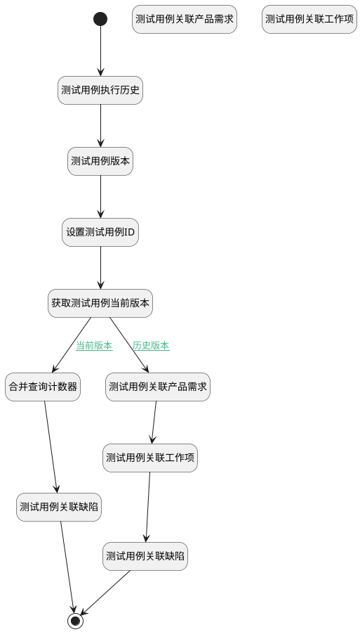

## 测试用例关联分页计数器 <!-- {docsify-ignore-all} -->

   计算分页下关联事项的条数

### 处理过程




### 处理步骤说明

#### 测试用例关联产品需求 :id=RAWSQLCALL1<sup class="footnote-symbol"> <font color=gray size=1>[直接SQL调用]</font></sup>


<p class="panel-title"><b>执行sql语句</b></p>

```sql
SELECT
	count( t.id ) AS test_case_re_idea 
FROM
	idea t 
WHERE
	EXISTS (
	SELECT
		* 
	FROM
		`RELATION` t11 
	WHERE
		t.`ID` = t11.`TARGET_ID` 
		AND (
			t11.`TARGET_TYPE` = 'idea' 
			AND t11.`PRINCIPAL_TYPE` = 'test_case' 
			AND t11.`PRINCIPAL_ID` = ? ) )
		    AND t.`IS_DELETED` = 0 
			
```

<p class="panel-title"><b>执行sql参数</b></p>

1. `Default(传入变量).ID(标识)`

重置参数`Default(传入变量)`，并将执行sql结果赋值给参数`Default(传入变量)`

#### 测试用例关联工作项 :id=RAWSQLCALL2<sup class="footnote-symbol"> <font color=gray size=1>[直接SQL调用]</font></sup>


<p class="panel-title"><b>执行sql语句</b></p>

```sql
SELECT
	count( t.id ) AS test_case_re_work_item 
FROM
	work_item t, work_item_type t1 
WHERE
t.work_item_type_id = t1.id
and t1.`group` <> 'bug' 
AND EXISTS (
	SELECT
		* 
	FROM
		`RELATION` t11 
	WHERE
		t.`ID` = t11.`TARGET_ID` 
		AND (
			t11.`TARGET_TYPE` = 'work_item' 
			AND t11.`PRINCIPAL_TYPE` = 'test_case' 
			AND t11.`PRINCIPAL_ID` = ? ) )
			AND  t.`IS_DELETED` = 0
			
```

<p class="panel-title"><b>执行sql参数</b></p>

1. `Default(传入变量).ID(标识)`

重置参数`Default(传入变量)`，并将执行sql结果赋值给参数`Default(传入变量)`

#### 开始 :id=Begin<sup class="footnote-symbol"> <font color=gray size=1>[开始]</font></sup>


*- N/A*
#### 结束 :id=END1<sup class="footnote-symbol"> <font color=gray size=1>[结束]</font></sup>


返回 `Default(传入变量)`

#### 测试用例执行历史 :id=RAWSQLCALL4<sup class="footnote-symbol"> <font color=gray size=1>[直接SQL调用]</font></sup>


<p class="panel-title"><b>执行sql语句</b></p>

```sql
SELECT
	count( t.id ) AS test_case_re_run_history
FROM
	run t 
WHERE
    t.case_id = ? and `STATUS` is not null
```

<p class="panel-title"><b>执行sql参数</b></p>

1. `Default(传入变量).ID(标识)`

重置参数`Default(传入变量)`，并将执行sql结果赋值给参数`Default(传入变量)`

#### 测试用例版本 :id=RAWSQLCALL5<sup class="footnote-symbol"> <font color=gray size=1>[直接SQL调用]</font></sup>


<p class="panel-title"><b>执行sql语句</b></p>

```sql
SELECT
	count( t.id ) AS test_case_version
FROM
	`version` t 
WHERE
    t.owner_id = ? and t.owner_type = 'TEST_CASE'
```

<p class="panel-title"><b>执行sql参数</b></p>

1. `Default(传入变量).ID(标识)`

重置参数`Default(传入变量)`，并将执行sql结果赋值给参数`Default(传入变量)`

#### 设置测试用例ID :id=PREPAREPARAM1<sup class="footnote-symbol"> <font color=gray size=1>[准备参数]</font></sup>


1. 将`Default(传入变量).ID(标识)` 设置给  `test_case(测试用例).ID(标识)`

#### 获取测试用例当前版本 :id=DEACTION1<sup class="footnote-symbol"> <font color=gray size=1>[实体行为]</font></sup>


调用实体 [用例(TEST_CASE)](module/TestMgmt/test_case.md) 行为 [Get](module/TestMgmt/test_case#行为) ，行为参数为`test_case(测试用例)`

将执行结果返回给参数`test_case(测试用例)`

#### 合并查询计数器 :id=RAWSQLCALL9<sup class="footnote-symbol"> <font color=gray size=1>[直接SQL调用]</font></sup>


<p class="panel-title"><b>执行sql语句</b></p>

```sql
SELECT
    COALESCE(SUM(CASE WHEN t11.`TARGET_TYPE` = 'idea' AND t11.`PRINCIPAL_TYPE` = 'test_case' AND t1.IS_DELETED=0 THEN 1 ELSE 0 END),0) AS test_case_re_idea,
    COALESCE(SUM(CASE WHEN t11.`TARGET_TYPE` = 'ticket' AND t11.`PRINCIPAL_TYPE` = 'test_case' AND t2.IS_DELETED=0 THEN 1 ELSE 0 END),0) AS test_case_re_test_case,
    COALESCE(SUM(CASE WHEN t11.`TARGET_TYPE` = 'work_item' AND t11.`PRINCIPAL_TYPE` = 'test_case' AND t4.IS_DELETED=0 THEN 1 ELSE 0 END),0) AS test_case_re_work_item
FROM
    `RELATION` t11
JOIN
    `test_case` t ON t.`ID` = t11.`PRINCIPAL_ID`
LEFT JOIN
    `idea` t1 ON t1.ID = t11.TARGET_ID 
LEFT JOIN
    `test_case` t2 ON t2.`ID` = t11.`TARGET_ID`
LEFT JOIN
    `work_item` t4 ON t4.ID = t11.TARGET_ID
WHERE
    (t11.`PRINCIPAL_ID` = ?);
```

<p class="panel-title"><b>执行sql参数</b></p>

1. `Default(传入变量).ID(标识)`

重置参数`Default(传入变量)`，并将执行sql结果赋值给参数`Default(传入变量)`

#### 测试用例关联缺陷 :id=RAWSQLCALL3<sup class="footnote-symbol"> <font color=gray size=1>[直接SQL调用]</font></sup>


<p class="panel-title"><b>执行sql语句</b></p>

```sql
SELECT
	count( t.id ) AS test_case_re_bug 
FROM
	work_item t, work_item_type t1 
WHERE t.work_item_type_id = t1.id and t1.`group` = 'bug'
and	EXISTS (
	SELECT
		* 
	FROM
		`RELATION` t11 
	WHERE
		t.`ID` = t11.`TARGET_ID` 
		AND (
			t11.`TARGET_TYPE` = 'work_item' 
			AND t11.`PRINCIPAL_TYPE` = 'test_case'
			AND t11.`PRINCIPAL_ID` = ? ) )
			AND t.`IS_DELETED` = 0
			
```

<p class="panel-title"><b>执行sql参数</b></p>

1. `Default(传入变量).ID(标识)`

重置参数`Default(传入变量)`，并将执行sql结果赋值给参数`Default(传入变量)`

#### 测试用例关联产品需求 :id=RAWSQLCALL6<sup class="footnote-symbol"> <font color=gray size=1>[直接SQL调用]</font></sup>


<p class="panel-title"><b>执行sql语句</b></p>

```sql
SELECT
	count( t.id ) AS test_case_re_idea
FROM
	idea t 
WHERE
t.is_deleted = 0
AND EXISTS (
	SELECT
			*
	FROM
		version_data t12
	WHERE
		 ( t12.`OWNER_TYPE` = 'RELATION' AND t12.`PARENT_ID` = ? ) 
		AND t12.PARENT_VERSION_ID = ?
		AND t.`ID` =  JSON_UNQUOTE(t12.`DATA`-> '$.target_id') 
	)
```

<p class="panel-title"><b>执行sql参数</b></p>

1. `Default(传入变量).ID(标识)`
2. `Default(传入变量).srfversionid`

重置参数`Default(传入变量)`，并将执行sql结果赋值给参数`Default(传入变量)`

#### 测试用例关联工作项 :id=RAWSQLCALL7<sup class="footnote-symbol"> <font color=gray size=1>[直接SQL调用]</font></sup>


<p class="panel-title"><b>执行sql语句</b></p>

```sql
SELECT
	count( t.id ) AS test_case_re_work_item
FROM
	work_item t, work_item_type t1
WHERE t.work_item_type_id = t1.id and t1.`group` <> 'bug'
and t.is_deleted = 0
AND EXISTS (
	SELECT
			*
	FROM
		version_data t12
	WHERE
		 ( t12.`OWNER_TYPE` = 'RELATION' AND t12.`PARENT_ID` = ? ) 
		AND t12.PARENT_VERSION_ID = ?
		AND t.`ID` =  JSON_UNQUOTE(t12.`DATA`-> '$.target_id') 
	)
```

<p class="panel-title"><b>执行sql参数</b></p>

1. `Default(传入变量).ID(标识)`
2. `Default(传入变量).srfversionid`

重置参数`Default(传入变量)`，并将执行sql结果赋值给参数`Default(传入变量)`

#### 测试用例关联缺陷 :id=RAWSQLCALL8<sup class="footnote-symbol"> <font color=gray size=1>[直接SQL调用]</font></sup>


<p class="panel-title"><b>执行sql语句</b></p>

```sql
SELECT
	count( t.id ) AS test_case_re_bug
FROM
	work_item t, work_item_type t1
WHERE t.work_item_type_id = t1.id and t1.`group` = 'bug'
and t.is_deleted = 0
AND EXISTS (
	SELECT
			*
	FROM
		version_data t12
	WHERE
		 ( t12.`OWNER_TYPE` = 'RELATION' AND t12.`PARENT_ID` = ? ) 
		AND t12.PARENT_VERSION_ID = ?
		AND t.`ID` =  JSON_UNQUOTE(t12.`DATA`-> '$.target_id') 
	)
```

<p class="panel-title"><b>执行sql参数</b></p>

1. `Default(传入变量).ID(标识)`
2. `Default(传入变量).srfversionid`

重置参数`Default(传入变量)`，并将执行sql结果赋值给参数`Default(传入变量)`


### 连接条件说明
#### 当前版本 :id=DEACTION1-RAWSQLCALL9

(`Default(传入变量).srfversionid` ISNULL OR (`Default(传入变量).srfversionid` ISNOTNULL AND ))
#### 历史版本 :id=DEACTION1-RAWSQLCALL6

`Default(传入变量).srfversionid` ISNOTNULL AND 


### 实体逻辑参数

|    中文名   |    代码名    |  数据类型    |  实体   |备注 |
| --------| --------| -------- | -------- | --------   |
|传入变量(<i class="fa fa-check"/></i>)|Default|数据对象|[用例(TEST_CASE)](module/TestMgmt/test_case.md)||
|测试用例|test_case|数据对象|[用例(TEST_CASE)](module/TestMgmt/test_case.md)||
