## 计算变更版本 <!-- {docsify-ignore-all} -->

   未完成

### 处理过程

```plantuml
@startuml
hide footbox
<style>
root {
  HyperlinkColor #42b983
}
</style>

hide empty description
state "开始" as Begin <<start>> [[$./cal_change_type#begin {开始}]]
state "准备参数" as PREPAREJSPARAM1  [[$./cal_change_type#preparejsparam1 {准备参数}]]
state "结束" as END1 <<end>> [[$./cal_change_type#end1 {结束}]]


Begin --> PREPAREJSPARAM1
PREPAREJSPARAM1 --> END1


@enduml
```

### 处理步骤说明

#### 开始 :id=Begin [开始]

#### 结束 :id=END1 [结束]

#### 准备参数 :id=PREPAREJSPARAM1 [准备参数]

1. 将`grid(表格).state.rows` 绑定给  `rows(表格行)`

### 实体逻辑参数

|    中文名   |    代码名    |  数据类型      |备注 |
| --------| --------| --------  | --------   |
|表格行|rows|数据对象||
|view|view|当前视图对象||
|传入变量(<i class="fa fa-check"/></i>)|Default|数据对象||
|表格|grid|部件对象||
|结果|result|数据对象列表||
