## 清空表单关注人 <!-- {docsify-ignore-all} -->

   清空表单关注人

### 处理过程

```plantuml
@startuml
hide footbox
<style>
root {
  HyperlinkColor #42b983
}
</style>

hide empty description
state "开始" as Begin <<start>> [[$./clean_attentions#begin {开始}]]
state "清空附件数据" as RAWJSCODE2  [[$./clean_attentions#rawjscode2 {清空附件数据}]]
state "结束" as END1 <<end>> [[$./clean_attentions#end1 {结束}]]
state "设置新关注人" as RAWJSCODE1  [[$./clean_attentions#rawjscode1 {设置新关注人}]]


Begin --> RAWJSCODE1
RAWJSCODE1 --> RAWJSCODE2
RAWJSCODE2 --> END1


@enduml
```




### 处理步骤说明

#### 开始 :id=Begin<sup class="footnote-symbol"> <font color=gray size=1>[开始]</font></sup>


#### 结束 :id=END1<sup class="footnote-symbol"> <font color=gray size=1>[结束]</font></sup>


#### 设置新关注人 :id=RAWJSCODE1<sup class="footnote-symbol"> <font color=gray size=1>[直接前台代码]</font></sup>


<p class="panel-title"><b>执行代码</b></p>

```javascript
const old_data = uiLogic.form.data;
// 清空关注人数组
old_data.attentions = [];
const ctx = uiLogic.ctx;
// 创建新的数据对象
const new_data = {
    user_id: ctx.srfuserid,
    name: ctx.srfusername,
    type: 40
};
uiLogic.form.data.attentions.push(new_data);


```

#### 清空附件数据 :id=RAWJSCODE2<sup class="footnote-symbol"> <font color=gray size=1>[直接前台代码]</font></sup>


<p class="panel-title"><b>执行代码</b></p>

```javascript
const app2 = ibiz.hub.getApp(context.srfappid);
app2.deService.exec('plmweb.attachment', 'fetchdefault', {...context, test_case: viewParam.id}).then((res) => {
    const attachments = res.data || [];
    attachments.forEach((attachment) => {
        app2.deService.exec('plmweb.attachment', 'remove', {...context, attachment: attachment.srfkey}, attachment);
    })
})
```


### 实体逻辑参数

|    中文名   |    代码名    |  数据类型      |备注 |
| --------| --------| --------  | --------   |
|上下文|ctx|导航视图参数绑定参数||
|关注人信息|attentions|数据对象||
|当前视图|view|当前视图对象||
|传入变量(<i class="fa fa-check"/></i>)|Default|数据对象||
|表单|form|部件对象||
