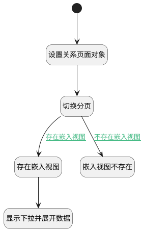

## 关联缺陷（工具栏） <!-- {docsify-ignore-all} -->

   主视图工具栏上点击触发，切换分页，打开下拉菜单

### 处理过程




### 处理步骤说明

#### 开始 :id=Begin<sup class="footnote-symbol"> <font color=gray size=1>[开始]</font></sup>


#### 设置关系页面对象 :id=PREPAREJSPARAM2<sup class="footnote-symbol"> <font color=gray size=1>[准备参数]</font></sup>


1. 将`form(表单).details.tabpanel1_bug_druipart` 设置给  `druipart(嵌入视图对象)`

#### 切换分页 :id=RAWJSCODE1<sup class="footnote-symbol"> <font color=gray size=1>[直接前台代码]</font></sup>


<p class="panel-title"><b>执行代码</b></p>

```javascript
uiLogic.form.details.tabpanel1.state.activeTab = 'tabpanel1_bug'
```

#### 存在嵌入视图 :id=PREPAREJSPARAM1<sup class="footnote-symbol"> <font color=gray size=1>[准备参数]</font></sup>


    无

#### 显示下拉并展开数据 :id=DEUIACTION1<sup class="footnote-symbol"> <font color=gray size=1>[实体界面行为调用]</font></sup>


调用实体 [需求(IDEA)](module/ProdMgmt/idea.md) 界面行为 [显示下拉并展开数据（嵌入视图）](module/ProdMgmt/idea#界面行为) ，行为参数为`embedView(嵌入视图)`

#### 嵌入视图不存在 :id=RAWJSCODE2<sup class="footnote-symbol"> <font color=gray size=1>[直接前台代码]</font></sup>


<p class="panel-title"><b>执行代码</b></p>

```javascript
uiLogic.druipart.navContext.srfshowchoose = true;
```

### 连接条件说明
#### 存在嵌入视图 :id=RAWJSCODE1-PREPAREJSPARAM1

```druipart(嵌入视图对象).embedView``` ISNOTNULL
#### 不存在嵌入视图 :id=RAWJSCODE1-RAWJSCODE2

```druipart(嵌入视图对象).embedView``` ISNULL


### 实体逻辑参数

|    中文名   |    代码名    |  数据类型      |备注 |
| --------| --------| --------  | --------   |
|嵌入视图|embedView|数据对象||
|嵌入视图对象|druipart|数据对象||
|视图|view|当前视图对象||
|传入变量(<i class="fa fa-check"/></i>)|Default|简单数据||
|表单|form|部件对象||
