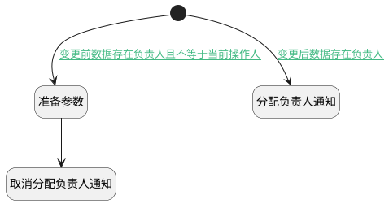

## 负责人变更附加逻辑 <!-- {docsify-ignore-all} -->

   测试计划负责人变更时触发相应的通知消息

### 处理过程

### 处理步骤说明

#### 开始 :id=Begin [开始]

*- N/A*
#### 准备参数 :id=PREPAREPARAM1 [准备参数]

1. 将`Default(传入变量).UPDATE_MAN(更新人)` 设置给  `Last(变更前).UPDATE_MAN`
2. 将`Default(传入变量).UPDATE_TIME(更新时间)` 设置给  `Last(变更前).UPDATE_TIME`

#### 分配负责人通知 :id=DENOTIFY1 [实体通知]

调用实体 [测试计划(TEST_PLAN)](module/TestMgmt/test_plan.md) 通知 [测试计划分配负责人通知(assignee_notify)](module/TestMgmt/test_plan/notify/assignee_notify) ，参数为`Default(传入变量)`
#### 取消分配负责人通知 :id=DENOTIFY2 [实体通知]

调用实体 [测试计划(TEST_PLAN)](module/TestMgmt/test_plan.md) 通知 [测试计划取消分配负责人通知(assignee_cancel_notify)](module/TestMgmt/test_plan/notify/assignee_cancel_notify) ，参数为`Last(变更前)`

### 连接条件说明
#### 变更后数据存在负责人 :id=Begin-DENOTIFY1

`Default(传入变量).ASSIGNEE_ID(负责人标识)` ISNOTNULL AND 
#### 变更前数据存在负责人且不等于当前操作人 :id=Begin-PREPAREPARAM1

`Last(变更前).ASSIGNEE_ID` ISNOTNULL AND 

### 实体逻辑参数

|    中文名   |    代码名    |  数据类型    |  实体   |备注 |
| --------| --------| -------- | -------- | --------   |
|传入变量(<i class="fa fa-check"/></i>)|Default|数据对象|[测试计划(TEST_PLAN)](module/TestMgmt/test_plan.md)||
|变更前|Last|最后数据变量|||
