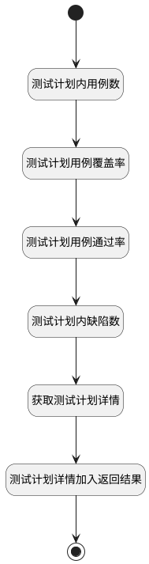

## 测试报告概览数据源 <!-- {docsify-ignore-all} -->

   测试报告概览的数据源

### 处理过程




### 处理步骤说明

#### 开始 :id=Begin<sup class="footnote-symbol"> <font color=gray size=1>[开始]</font></sup>


*- N/A*
#### 结束 :id=END1<sup class="footnote-symbol"> <font color=gray size=1>[结束]</font></sup>


返回 `result(结果)`

#### 测试计划内用例数 :id=RAWSQLCALL1<sup class="footnote-symbol"> <font color=gray size=1>[直接SQL调用]</font></sup>


<p class="panel-title"><b>执行sql语句</b></p>

```sql
select count(1) as case_count from test_plan tp left join run r on tp.ID = r.PLAN_ID where tp.ID = ?;
```

<p class="panel-title"><b>执行sql参数</b></p>

1. `Default(传入变量).ID(标识)`

重置参数`result(结果)`，并将执行sql结果赋值给参数`result(结果)`

#### 测试计划用例覆盖率 :id=RAWSQLCALL2<sup class="footnote-symbol"> <font color=gray size=1>[直接SQL调用]</font></sup>


<p class="panel-title"><b>执行sql语句</b></p>

```sql
SELECT
    ROUND((COUNT(DISTINCT r.CASE_ID) * 100.0 / COUNT(DISTINCT tc.ID)), 1) AS Coverage_Percentage
FROM
    test_plan tp
        LEFT JOIN
    test_case tc ON tp.LIBRARY_ID = tc.TEST_LIBRARY_ID and tc.IS_DELETED = 0
        LEFT JOIN
    run r ON tp.ID = r.PLAN_ID AND tc.ID = r.CASE_ID
WHERE
        tp.ID = ?;
```

<p class="panel-title"><b>执行sql参数</b></p>

1. `Default(传入变量).ID(标识)`

重置参数`result(结果)`，并将执行sql结果赋值给参数`result(结果)`

#### 测试计划用例通过率 :id=RAWSQLCALL3<sup class="footnote-symbol"> <font color=gray size=1>[直接SQL调用]</font></sup>


<p class="panel-title"><b>执行sql语句</b></p>

```sql
SELECT
    CASE
        WHEN COUNT(DISTINCT r.CASE_ID) > 0 THEN ROUND((COUNT(DISTINCT CASE WHEN r.STATUS = '10' THEN r.CASE_ID END) * 100.0 / COUNT(DISTINCT r.CASE_ID)), 1)
        ELSE 0
        END AS Pass_Percentage
FROM
    test_plan tp
        LEFT JOIN
    run r ON tp.ID = r.PLAN_ID
WHERE
        tp.ID = ?;
```

<p class="panel-title"><b>执行sql参数</b></p>

1. `Default(传入变量).ID(标识)`

重置参数`result(结果)`，并将执行sql结果赋值给参数`result(结果)`

#### 测试计划内缺陷数 :id=RAWSQLCALL4<sup class="footnote-symbol"> <font color=gray size=1>[直接SQL调用]</font></sup>


<p class="panel-title"><b>执行sql语句</b></p>

```sql
SELECT
count(1) as bug_count
FROM `WORK_ITEM` t1
         LEFT JOIN `WORK_ITEM_TYPE` t21 ON t1.`WORK_ITEM_TYPE_ID` = t21.`ID`
WHERE
    ( t1.`IS_DELETED` = 0  AND  t21.`GROUP` = 'bug'  AND  (
            EXISTS (
                -- 与计划ID关联的RUN的WORK_ITEM
                    SELECT 1
                    FROM `relation` rel
                             INNER JOIN `RUN` ru ON ru.`ID` = rel.`PRINCIPAL_ID`
                    WHERE
                            rel.`TARGET_ID` = t1.`ID`
                      AND ru.`PLAN_ID` = ?
                      AND rel.`TARGET_TYPE` = 'work_item'
                      AND rel.`PRINCIPAL_TYPE` = 'run'
                )
            OR EXISTS (
                -- 直接与计划ID关联的WORK_ITEM
                    SELECT 1
                    FROM `relation` r
                    WHERE
                            r.`TARGET_ID` = t1.`ID`
                      AND r.`PRINCIPAL_ID` = ?
                      AND r.`TARGET_TYPE` = 'work_item'
                      AND r.`PRINCIPAL_TYPE` = 'test_plan'
                )
        ) )
```

<p class="panel-title"><b>执行sql参数</b></p>

1. `Default(传入变量).ID(标识)`
2. `Default(传入变量).ID(标识)`

重置参数`result(结果)`，并将执行sql结果赋值给参数`result(结果)`

#### 获取测试计划详情 :id=DEACTION1<sup class="footnote-symbol"> <font color=gray size=1>[实体行为]</font></sup>


调用实体 [测试计划(TEST_PLAN)](module/TestMgmt/test_plan.md) 行为 [Get](module/TestMgmt/test_plan#行为) ，行为参数为`Default(传入变量)`

将执行结果返回给参数`plan_info(计划信息)`

#### 测试计划详情加入返回结果 :id=PREPAREPARAM1<sup class="footnote-symbol"> <font color=gray size=1>[准备参数]</font></sup>


1. 将`plan_info(计划信息)` 设置给  `result(结果).plan_info`


### 实体逻辑参数

|    中文名   |    代码名    |  数据类型    |  实体   |备注 |
| --------| --------| -------- | -------- | --------   |
|传入变量(<i class="fa fa-check"/></i>)|Default|数据对象|[测试计划(TEST_PLAN)](module/TestMgmt/test_plan.md)||
|计划信息|plan_info|数据对象|||
|结果|result|数据对象|||
