## 设置门户默认搜索时间 <!-- {docsify-ignore-all} -->

   在门户部件上配置视图逻辑，设置门户默认搜索时间

### 处理过程

```plantuml
@startuml
hide footbox
<style>
root {
  HyperlinkColor #42b983
}
</style>

hide empty description
state "开始" as Begin <<start>> [[$./set_portlet_search_date#begin {开始}]]
state "结束" as END1 <<end>> [[$./set_portlet_search_date#end1 {结束}]]
state "获取门户控制器" as PREPAREJSPARAM1  [[$./set_portlet_search_date#preparejsparam1 {获取门户控制器}]]
state "设置默认时间" as RAWJSCODE2  [[$./set_portlet_search_date#rawjscode2 {设置默认时间}]]
state "设置门户参数" as RAWJSCODE3  [[$./set_portlet_search_date#rawjscode3 {设置门户参数}]]


Begin --> PREPAREJSPARAM1
PREPAREJSPARAM1 --> RAWJSCODE2
RAWJSCODE2 --> RAWJSCODE3
RAWJSCODE3 --> END1


@enduml
```




### 处理步骤说明

#### 开始 :id=Begin<sup class="footnote-symbol"> <font color=gray size=1>[开始]</font></sup>


#### 结束 :id=END1<sup class="footnote-symbol"> <font color=gray size=1>[结束]</font></sup>


#### 获取门户控制器 :id=PREPAREJSPARAM1<sup class="footnote-symbol"> <font color=gray size=1>[准备参数]</font></sup>


1. 将`dashboard(部件).portlets.daily_test` 设置给  `daily_test(每日测试门户)`
2. 将`dashboard(部件).portlets.daily_tendencies` 设置给  `daily_tendencies(每日执行门户)`

#### 设置默认时间 :id=RAWJSCODE2<sup class="footnote-symbol"> <font color=gray size=1>[直接前台代码]</font></sup>


<p class="panel-title"><b>执行代码</b></p>

```javascript
const currentDate = new Date();
const lastDate = new Date(currentDate.getTime() - 604800000);

const curYear = currentDate.getFullYear();
const curMonth = (currentDate.getMonth() + 1).toString().padStart(2, '0');
const curDay = currentDate.getDate().toString().padStart(2, '0');
const lastYear = lastDate.getFullYear();
const lastMonth = (lastDate.getMonth() + 1).toString().padStart(2, '0');
const lastDay = lastDate.getDate().toString().padStart(2, '0');

uiLogic.defaultDate = {
    n_create_time_gtandeq: `${lastYear}-${lastMonth}-${lastDay}`,
    n_create_time_ltandeq: `${curYear}-${curMonth}-${curDay}`
}
```

#### 设置门户参数 :id=RAWJSCODE3<sup class="footnote-symbol"> <font color=gray size=1>[直接前台代码]</font></sup>


<p class="panel-title"><b>执行代码</b></p>

```javascript
const { daily_test, daily_tendencies } = uiLogic;
if (daily_test) {
    Object.assign(daily_test.params, uiLogic.defaultDate);
}
if (daily_tendencies) {
    Object.assign(daily_tendencies.params, uiLogic.defaultDate);
}
```


### 实体逻辑参数

|    中文名   |    代码名    |  数据类型      |备注 |
| --------| --------| --------  | --------   |
|默认时间|defaultDate|数据对象||
|部件|dashboard|当前部件对象||
|传入变量(<i class="fa fa-check"/></i>)|Default|数据对象||
|每日测试门户|daily_test|数据对象||
|每日执行门户|daily_tendencies|数据对象||
