## 移入计划 <!-- {docsify-ignore-all} -->

   获取选中数据，通过后台处理，完成测试用例移入计划操作

### 处理过程

```plantuml
@startuml
hide footbox
<style>
root {
  HyperlinkColor #42b983
}
</style>

hide empty description
state "开始" as Begin <<start>> [[$./shift_in_test_plan#begin {开始}]]
state "界面行为" as DEUIACTION1  [[$./shift_in_test_plan#deuiaction1 {界面行为}]]
state "获取选中数据" as RAWJSCODE1  [[$./shift_in_test_plan#rawjscode1 {获取选中数据}]]
state "填充属性" as PREPAREJSPARAM1  [[$./shift_in_test_plan#preparejsparam1 {填充属性}]]
state "实体行为" as DEACTION1  [[$./shift_in_test_plan#deaction1 {实体行为}]]
state "结束" as END1 <<end>> [[$./shift_in_test_plan#end1 {结束}]]


Begin --> RAWJSCODE1
RAWJSCODE1 --> PREPAREJSPARAM1
PREPAREJSPARAM1 --> DEACTION1
DEACTION1 --> DEUIACTION1
DEUIACTION1 --> END1


@enduml
```




### 处理步骤说明

#### 开始 :id=Begin<sup class="footnote-symbol"> <font color=gray size=1>[开始]</font></sup>


#### 获取选中数据 :id=RAWJSCODE1<sup class="footnote-symbol"> <font color=gray size=1>[直接前台代码]</font></sup>


<p class="panel-title"><b>执行代码</b></p>

```javascript
let selecteddata=uiLogic.view.ctx.controllersMap.get("test_planpick_up_view_PickupGridView").ctx.controllersMap.get("grid").state.selectedData;
if (selecteddata.length > 0) {
    uiLogic.selectobj = selecteddata[0];
}
```

#### 填充属性 :id=PREPAREJSPARAM1<sup class="footnote-symbol"> <font color=gray size=1>[准备参数]</font></sup>


1. 将`ctx(上下文变量).test_case` 设置给  `updateobj(更新工作项对象).case_id`
2. 将`selectobj(选中迭代对象).id` 设置给  `updateobj(更新工作项对象).plan_id`

#### 实体行为 :id=DEACTION1<sup class="footnote-symbol"> <font color=gray size=1>[实体行为]</font></sup>


调用实体 [执行用例(RUN)](module/TestMgmt/run.md) 行为 [添加计划执行用例(add_plan_run)](module/TestMgmt/run#行为) ，行为参数为`updateobj(更新工作项对象)`

#### 界面行为 :id=DEUIACTION1<sup class="footnote-symbol"> <font color=gray size=1>[实体界面行为调用]</font></sup>


调用实体 [用例(TEST_CASE)](module/TestMgmt/test_case.md) 界面行为 [视图_确定](module/TestMgmt/test_case#界面行为) 

#### 结束 :id=END1<sup class="footnote-symbol"> <font color=gray size=1>[结束]</font></sup>


### 实体逻辑参数

|    中文名   |    代码名    |  数据类型      |备注 |
| --------| --------| --------  | --------   |
|选中迭代对象|selectobj|数据对象||
|更新工作项对象|updateobj|数据对象||
|runarray|runarray|数据对象列表||
|上下文变量|ctx|导航视图参数绑定参数||
|视图对象|view|当前视图对象||
|传入变量(<i class="fa fa-check"/></i>)|Default|数据对象||
