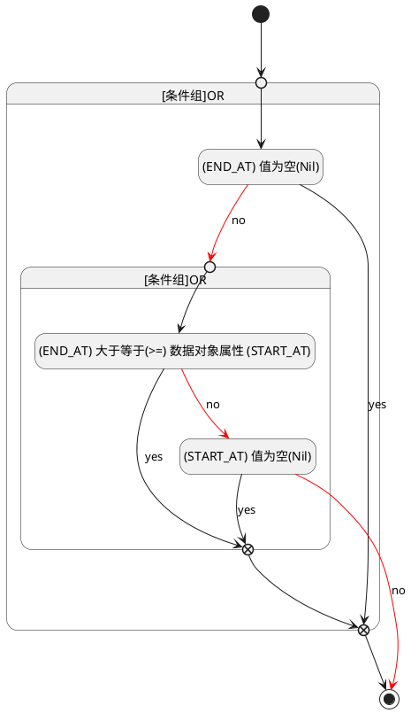

## 计划结束(END_AT) <!-- {docsify-ignore-all} -->

   

### 结束时间 :id=END_AT

#### 条件说明

##### (END_AT) 大于等于(>=) 数据对象属性 (START_AT) :id=a24837267aff98c9c3095e9c65fe60687

`END_AT(计划结束)` GTANDEQ  `START_AT`

> [!ATTENTION|label:规则信息|icon:fa fa-warning]
> 发布时间必须大于等于开始时间

##### (START_AT) 值为空(Nil) :id=a138011728460a5e3329af1ee31626249

`START_AT(计划开始)` ISNULL 

##### (END_AT) 值为空(Nil) :id=aba7325e335ecd4f14f073a874f34d652

`END_AT(计划结束)` ISNULL 

