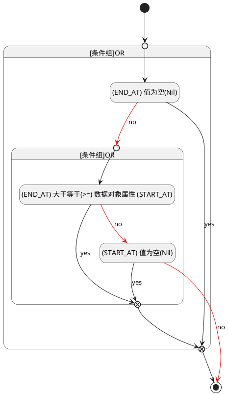

## 计划结束(END_AT) <!-- {docsify-ignore-all} -->

   

### 结束时间 :id=END_AT

#### 条件说明

##### (START_AT) 值为空(Nil) :id=aa315395376b03a2603567eb210edc7fb

`START_AT(计划开始)` ISNULL 

##### (END_AT) 大于等于(>=) 数据对象属性 (START_AT) :id=a87a8c624dfb7009e5c77de2be18df48d

`END_AT(计划结束)` GTANDEQ  `START_AT`

> [!ATTENTION|label:规则信息|icon:fa fa-warning]
> 发布时间必须大于等于开始时间

##### (END_AT) 值为空(Nil) :id=a72412dcb5ddaff886434d8f8bf8c77fa

`END_AT(计划结束)` ISNULL 

