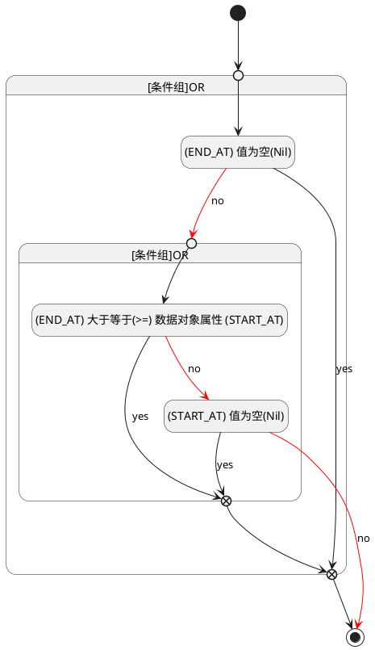

## 计划结束(END_AT) <!-- {docsify-ignore-all} -->

   

### 结束时间 :id=END_AT

```plantuml
@startuml
hide empty description
<style>
root {
  HyperlinkColor #42b983
}
</style>

state "start" as start  <<start>>
state "end" as end <<end>>
state "[条件组]OR" as 67a88226494e496f93b2510f057f0bb7 [[$./end_at#a67a88226494e496f93b2510f057f0bb7 {"[条件组]OR"}]] {
state " " as 67a88226494e496f93b2510f057f0bb7_entry  <<entryPoint>>
state "(END_AT) 值为空(Nil)" as ff183ee7734753335b55f5953e9fcf2f [[$./end_at#aff183ee7734753335b55f5953e9fcf2f {"[常规条件] 值为空(Nil)"}]]
state "[条件组]OR" as ab1f381cef3bd5adef383f0149d4fcae [[$./end_at#aab1f381cef3bd5adef383f0149d4fcae {"[条件组]OR"}]] {
state " " as ab1f381cef3bd5adef383f0149d4fcae_entry  <<entryPoint>>
state "(END_AT) 大于等于(>=) 数据对象属性 (START_AT)" as 3f8f6c3e1ea6e28a30d7d2e7cbc8ff2a [[$./end_at#a3f8f6c3e1ea6e28a30d7d2e7cbc8ff2a {"[常规条件] 大于等于(>=) 数据对象属性 (START_AT)"}]]
state "(START_AT) 值为空(Nil)" as 44980badb88e70cfa0f8d92937928a62 [[$./end_at#a44980badb88e70cfa0f8d92937928a62 {"[常规条件] 值为空(Nil)"}]]
state " " as ab1f381cef3bd5adef383f0149d4fcae_exit  <<exitPoint>>
}
state " " as 67a88226494e496f93b2510f057f0bb7_exit  <<exitPoint>>
}


start --> 67a88226494e496f93b2510f057f0bb7_entry 
67a88226494e496f93b2510f057f0bb7_entry --> ff183ee7734753335b55f5953e9fcf2f 
ff183ee7734753335b55f5953e9fcf2f --> 67a88226494e496f93b2510f057f0bb7_exit  : yes
ff183ee7734753335b55f5953e9fcf2f -[#red]-> ab1f381cef3bd5adef383f0149d4fcae_entry  : no

ab1f381cef3bd5adef383f0149d4fcae_entry --> 3f8f6c3e1ea6e28a30d7d2e7cbc8ff2a 
3f8f6c3e1ea6e28a30d7d2e7cbc8ff2a --> ab1f381cef3bd5adef383f0149d4fcae_exit  : yes
3f8f6c3e1ea6e28a30d7d2e7cbc8ff2a -[#red]-> 44980badb88e70cfa0f8d92937928a62  : no

44980badb88e70cfa0f8d92937928a62 --> ab1f381cef3bd5adef383f0149d4fcae_exit  : yes
44980badb88e70cfa0f8d92937928a62 -[#red]-> end  : no
ab1f381cef3bd5adef383f0149d4fcae_exit --> 67a88226494e496f93b2510f057f0bb7_exit 
67a88226494e496f93b2510f057f0bb7_exit --> end 


@enduml
```

#### 条件说明

##### (END_AT) 值为空(Nil) :id=aff183ee7734753335b55f5953e9fcf2f

`END_AT(计划结束)` ISNULL 

##### (END_AT) 大于等于(>=) 数据对象属性 (START_AT) :id=a3f8f6c3e1ea6e28a30d7d2e7cbc8ff2a

`END_AT(计划结束)` GTANDEQ  `START_AT`

> [!ATTENTION|label:规则信息|icon:fa fa-warning]
> 发布时间必须大于等于开始时间

##### (START_AT) 值为空(Nil) :id=a44980badb88e70cfa0f8d92937928a62

`START_AT(计划开始)` ISNULL 

