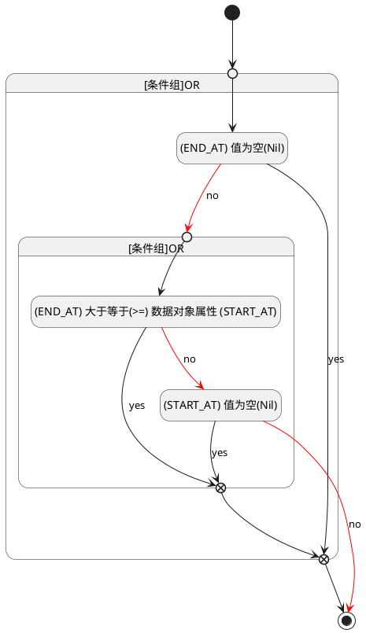

## 计划结束(END_AT) <!-- {docsify-ignore-all} -->

   

### 结束时间 :id=END_AT

```plantuml
@startuml
hide empty description
<style>
root {
  HyperlinkColor #42b983
}
</style>

state "start" as start  <<start>>
state "end" as end <<end>>
state "[条件组]OR" as fdf862586cd0bbf15667550ff86bf73b [[$./end_at#afdf862586cd0bbf15667550ff86bf73b {"[条件组]OR"}]] {
state " " as fdf862586cd0bbf15667550ff86bf73b_entry  <<entryPoint>>
state "(END_AT) 值为空(Nil)" as 645922d567b8acc64466b4023a6272fe [[$./end_at#a645922d567b8acc64466b4023a6272fe {"[常规条件] 值为空(Nil)"}]]
state "[条件组]OR" as fefa4525b8dc73dda92bbc5f3d4d9e61 [[$./end_at#afefa4525b8dc73dda92bbc5f3d4d9e61 {"[条件组]OR"}]] {
state " " as fefa4525b8dc73dda92bbc5f3d4d9e61_entry  <<entryPoint>>
state "(END_AT) 大于等于(>=) 数据对象属性 (START_AT)" as 0a82f1324bc567b89bee53dc8cd3d051 [[$./end_at#a0a82f1324bc567b89bee53dc8cd3d051 {"[常规条件] 大于等于(>=) 数据对象属性 (START_AT)"}]]
state "(START_AT) 值为空(Nil)" as 22a891da612ec3d3ae727a08a0846412 [[$./end_at#a22a891da612ec3d3ae727a08a0846412 {"[常规条件] 值为空(Nil)"}]]
state " " as fefa4525b8dc73dda92bbc5f3d4d9e61_exit  <<exitPoint>>
}
state " " as fdf862586cd0bbf15667550ff86bf73b_exit  <<exitPoint>>
}


start --> fdf862586cd0bbf15667550ff86bf73b_entry 
fdf862586cd0bbf15667550ff86bf73b_entry --> 645922d567b8acc64466b4023a6272fe 
645922d567b8acc64466b4023a6272fe --> fdf862586cd0bbf15667550ff86bf73b_exit  : yes
645922d567b8acc64466b4023a6272fe -[#red]-> fefa4525b8dc73dda92bbc5f3d4d9e61_entry  : no

fefa4525b8dc73dda92bbc5f3d4d9e61_entry --> 0a82f1324bc567b89bee53dc8cd3d051 
0a82f1324bc567b89bee53dc8cd3d051 --> fefa4525b8dc73dda92bbc5f3d4d9e61_exit  : yes
0a82f1324bc567b89bee53dc8cd3d051 -[#red]-> 22a891da612ec3d3ae727a08a0846412  : no

22a891da612ec3d3ae727a08a0846412 --> fefa4525b8dc73dda92bbc5f3d4d9e61_exit  : yes
22a891da612ec3d3ae727a08a0846412 -[#red]-> end  : no
fefa4525b8dc73dda92bbc5f3d4d9e61_exit --> fdf862586cd0bbf15667550ff86bf73b_exit 
fdf862586cd0bbf15667550ff86bf73b_exit --> end 


@enduml
```

#### 条件说明

##### (END_AT) 值为空(Nil) :id=a645922d567b8acc64466b4023a6272fe

`END_AT(计划结束)` ISNULL 

##### (START_AT) 值为空(Nil) :id=a22a891da612ec3d3ae727a08a0846412

`START_AT(计划开始)` ISNULL 

##### (END_AT) 大于等于(>=) 数据对象属性 (START_AT) :id=a0a82f1324bc567b89bee53dc8cd3d051

`END_AT(计划结束)` GTANDEQ  `START_AT`

> [!ATTENTION|label:规则信息|icon:fa fa-warning]
> 发布时间必须大于等于开始时间

