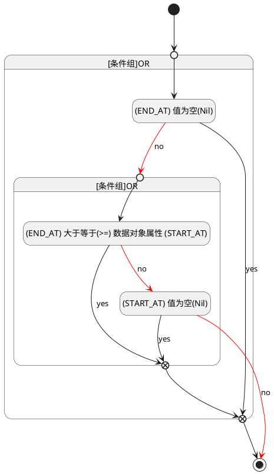

## 计划结束(END_AT) <!-- {docsify-ignore-all} -->

   

### 结束时间 :id=END_AT

```plantuml
@startuml
hide empty description
<style>
root {
  HyperlinkColor #42b983
}
</style>

state "start" as start  <<start>>
state "end" as end <<end>>
state "[条件组]OR" as 4fd38439d89547eeebfc3cbf9c8e49ca [[$./end_at#a4fd38439d89547eeebfc3cbf9c8e49ca {"[条件组]OR"}]] {
state " " as 4fd38439d89547eeebfc3cbf9c8e49ca_entry  <<entryPoint>>
state "(END_AT) 值为空(Nil)" as a315395376b03a2603567eb210edc7fb [[$./end_at#aa315395376b03a2603567eb210edc7fb {"[常规条件] 值为空(Nil)"}]]
state "[条件组]OR" as 40cd849a62e6d4026353d703b57882d4 [[$./end_at#a40cd849a62e6d4026353d703b57882d4 {"[条件组]OR"}]] {
state " " as 40cd849a62e6d4026353d703b57882d4_entry  <<entryPoint>>
state "(END_AT) 大于等于(>=) 数据对象属性 (START_AT)" as 8c1aa43742caba0c9e6421b8436e6458 [[$./end_at#a8c1aa43742caba0c9e6421b8436e6458 {"[常规条件] 大于等于(>=) 数据对象属性 (START_AT)"}]]
state "(START_AT) 值为空(Nil)" as 1f0abf23e462ac4c6b3db7c74eecf2bb [[$./end_at#a1f0abf23e462ac4c6b3db7c74eecf2bb {"[常规条件] 值为空(Nil)"}]]
state " " as 40cd849a62e6d4026353d703b57882d4_exit  <<exitPoint>>
}
state " " as 4fd38439d89547eeebfc3cbf9c8e49ca_exit  <<exitPoint>>
}


start --> 4fd38439d89547eeebfc3cbf9c8e49ca_entry 
4fd38439d89547eeebfc3cbf9c8e49ca_entry --> a315395376b03a2603567eb210edc7fb 
a315395376b03a2603567eb210edc7fb --> 4fd38439d89547eeebfc3cbf9c8e49ca_exit  : yes
a315395376b03a2603567eb210edc7fb -[#red]-> 40cd849a62e6d4026353d703b57882d4_entry  : no

40cd849a62e6d4026353d703b57882d4_entry --> 8c1aa43742caba0c9e6421b8436e6458 
8c1aa43742caba0c9e6421b8436e6458 --> 40cd849a62e6d4026353d703b57882d4_exit  : yes
8c1aa43742caba0c9e6421b8436e6458 -[#red]-> 1f0abf23e462ac4c6b3db7c74eecf2bb  : no

1f0abf23e462ac4c6b3db7c74eecf2bb --> 40cd849a62e6d4026353d703b57882d4_exit  : yes
1f0abf23e462ac4c6b3db7c74eecf2bb -[#red]-> end  : no
40cd849a62e6d4026353d703b57882d4_exit --> 4fd38439d89547eeebfc3cbf9c8e49ca_exit 
4fd38439d89547eeebfc3cbf9c8e49ca_exit --> end 


@enduml
```

#### 条件说明

##### (END_AT) 大于等于(>=) 数据对象属性 (START_AT) :id=a8c1aa43742caba0c9e6421b8436e6458

`END_AT(计划结束)` GTANDEQ  `START_AT`

> [!ATTENTION|label:规则信息|icon:fa fa-warning]
> 发布时间必须大于等于开始时间

##### (START_AT) 值为空(Nil) :id=a1f0abf23e462ac4c6b3db7c74eecf2bb

`START_AT(计划开始)` ISNULL 

##### (END_AT) 值为空(Nil) :id=aa315395376b03a2603567eb210edc7fb

`END_AT(计划结束)` ISNULL 

