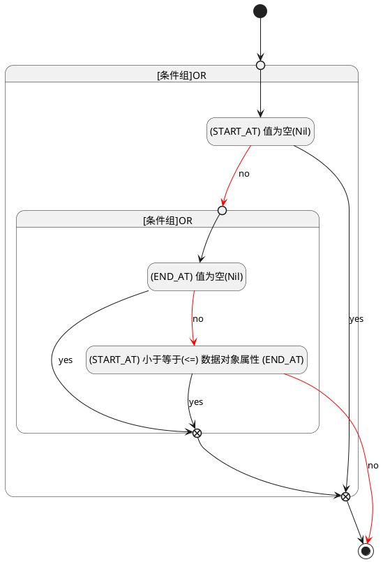

## 计划开始(START_AT) <!-- {docsify-ignore-all} -->

   

### 开始时间 :id=START_AT

#### 条件说明

##### (START_AT) 值为空(Nil) :id=aaaf388c8d299e9dc46ef661a886bfe5e

`START_AT(计划开始)` ISNULL 

##### (END_AT) 值为空(Nil) :id=a3361fc2ec7e8966d24e12bfb0db671c3

`END_AT(计划结束)` ISNULL 

##### (START_AT) 小于等于(<=) 数据对象属性 (END_AT) :id=a297bfed5a8c7c03c3965b054977aa3f2

`START_AT(计划开始)` LTANDEQ  `END_AT`

> [!ATTENTION|label:规则信息|icon:fa fa-warning]
> 开始时间必须小于等于发布时间

