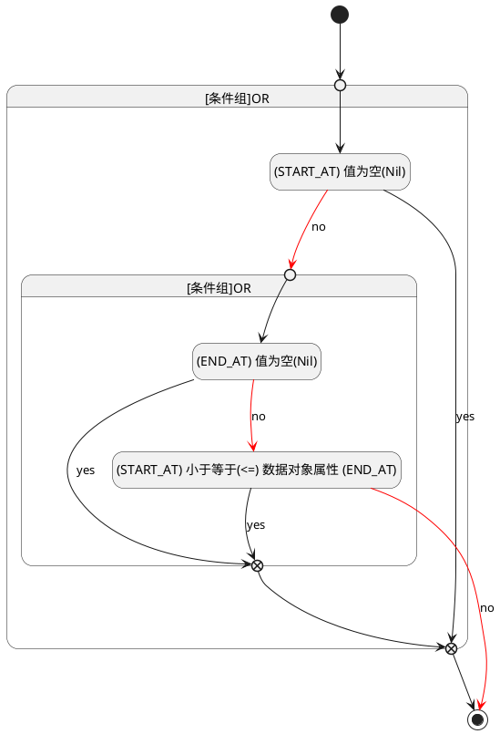

## 计划开始(START_AT) <!-- {docsify-ignore-all} -->

   

### 开始时间 :id=START_AT

```plantuml
@startuml
hide empty description
<style>
root {
  HyperlinkColor #42b983
}
</style>

state "start" as start  <<start>>
state "end" as end <<end>>
state "[条件组]OR" as 1daa167dfae7715b815966c582cf27bd [[$./start_at#a1daa167dfae7715b815966c582cf27bd {"[条件组]OR"}]] {
state " " as 1daa167dfae7715b815966c582cf27bd_entry  <<entryPoint>>
state "(START_AT) 值为空(Nil)" as 297bfed5a8c7c03c3965b054977aa3f2 [[$./start_at#a297bfed5a8c7c03c3965b054977aa3f2 {"[常规条件] 值为空(Nil)"}]]
state "[条件组]OR" as d9f8ca0ec39e3fb6c679c270ccbbf0f1 [[$./start_at#ad9f8ca0ec39e3fb6c679c270ccbbf0f1 {"[条件组]OR"}]] {
state " " as d9f8ca0ec39e3fb6c679c270ccbbf0f1_entry  <<entryPoint>>
state "(END_AT) 值为空(Nil)" as 70cb7ee69498007a0076b6dade3e3fd0 [[$./start_at#a70cb7ee69498007a0076b6dade3e3fd0 {"[常规条件] 值为空(Nil)"}]]
state "(START_AT) 小于等于(<=) 数据对象属性 (END_AT)" as f52a42a65f9150c3ed95db38a89b3bf6 [[$./start_at#af52a42a65f9150c3ed95db38a89b3bf6 {"[常规条件] 小于等于(<=) 数据对象属性 (END_AT)"}]]
state " " as d9f8ca0ec39e3fb6c679c270ccbbf0f1_exit  <<exitPoint>>
}
state " " as 1daa167dfae7715b815966c582cf27bd_exit  <<exitPoint>>
}


start --> 1daa167dfae7715b815966c582cf27bd_entry 
1daa167dfae7715b815966c582cf27bd_entry --> 297bfed5a8c7c03c3965b054977aa3f2 
297bfed5a8c7c03c3965b054977aa3f2 --> 1daa167dfae7715b815966c582cf27bd_exit  : yes
297bfed5a8c7c03c3965b054977aa3f2 -[#red]-> d9f8ca0ec39e3fb6c679c270ccbbf0f1_entry  : no

d9f8ca0ec39e3fb6c679c270ccbbf0f1_entry --> 70cb7ee69498007a0076b6dade3e3fd0 
70cb7ee69498007a0076b6dade3e3fd0 --> d9f8ca0ec39e3fb6c679c270ccbbf0f1_exit  : yes
70cb7ee69498007a0076b6dade3e3fd0 -[#red]-> f52a42a65f9150c3ed95db38a89b3bf6  : no

f52a42a65f9150c3ed95db38a89b3bf6 --> d9f8ca0ec39e3fb6c679c270ccbbf0f1_exit  : yes
f52a42a65f9150c3ed95db38a89b3bf6 -[#red]-> end  : no
d9f8ca0ec39e3fb6c679c270ccbbf0f1_exit --> 1daa167dfae7715b815966c582cf27bd_exit 
1daa167dfae7715b815966c582cf27bd_exit --> end 


@enduml
```

#### 条件说明

##### (START_AT) 小于等于(<=) 数据对象属性 (END_AT) :id=af52a42a65f9150c3ed95db38a89b3bf6

`START_AT(计划开始)` LTANDEQ  `END_AT`

> [!ATTENTION|label:规则信息|icon:fa fa-warning]
> 开始时间必须小于等于发布时间

##### (START_AT) 值为空(Nil) :id=a297bfed5a8c7c03c3965b054977aa3f2

`START_AT(计划开始)` ISNULL 

##### (END_AT) 值为空(Nil) :id=a70cb7ee69498007a0076b6dade3e3fd0

`END_AT(计划结束)` ISNULL 

