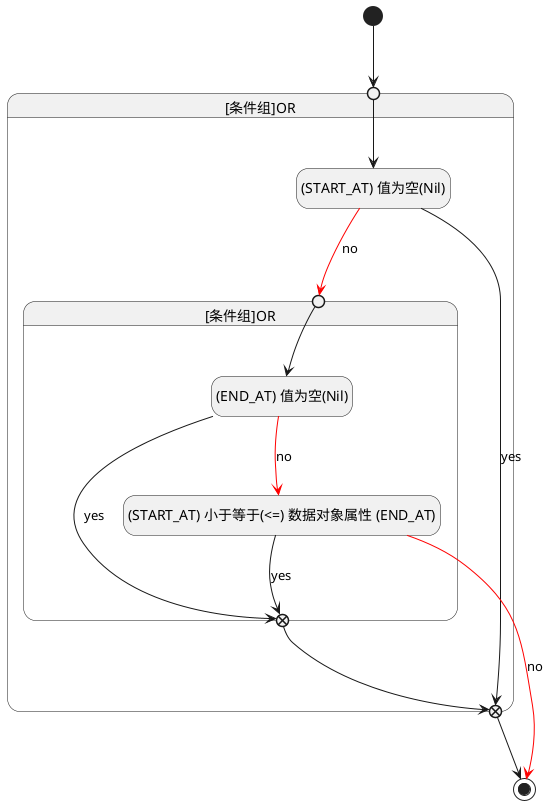

## 计划开始(START_AT) <!-- {docsify-ignore-all} -->

   

### 开始时间 :id=START_AT

```plantuml
@startuml
hide empty description
<style>
root {
  HyperlinkColor #42b983
}
</style>

state "start" as start  <<start>>
state "end" as end <<end>>
state "[条件组]OR" as 87d2063d7185bb2bc58dcd4580623b9b [[$./start_at#a87d2063d7185bb2bc58dcd4580623b9b {"[条件组]OR"}]] {
state " " as 87d2063d7185bb2bc58dcd4580623b9b_entry  <<entryPoint>>
state "(START_AT) 值为空(Nil)" as cf23fd051fb01b48886091e0f4b7ec71 [[$./start_at#acf23fd051fb01b48886091e0f4b7ec71 {"[常规条件] 值为空(Nil)"}]]
state "[条件组]OR" as d06bf2b4be7bce2dc26a3bd812c47055 [[$./start_at#ad06bf2b4be7bce2dc26a3bd812c47055 {"[条件组]OR"}]] {
state " " as d06bf2b4be7bce2dc26a3bd812c47055_entry  <<entryPoint>>
state "(END_AT) 值为空(Nil)" as de4846e15ec16298872117264a8734ad [[$./start_at#ade4846e15ec16298872117264a8734ad {"[常规条件] 值为空(Nil)"}]]
state "(START_AT) 小于等于(<=) 数据对象属性 (END_AT)" as 208e74bbe9814dd224d486d83128e151 [[$./start_at#a208e74bbe9814dd224d486d83128e151 {"[常规条件] 小于等于(<=) 数据对象属性 (END_AT)"}]]
state " " as d06bf2b4be7bce2dc26a3bd812c47055_exit  <<exitPoint>>
}
state " " as 87d2063d7185bb2bc58dcd4580623b9b_exit  <<exitPoint>>
}


start --> 87d2063d7185bb2bc58dcd4580623b9b_entry 
87d2063d7185bb2bc58dcd4580623b9b_entry --> cf23fd051fb01b48886091e0f4b7ec71 
cf23fd051fb01b48886091e0f4b7ec71 --> 87d2063d7185bb2bc58dcd4580623b9b_exit  : yes
cf23fd051fb01b48886091e0f4b7ec71 -[#red]-> d06bf2b4be7bce2dc26a3bd812c47055_entry  : no

d06bf2b4be7bce2dc26a3bd812c47055_entry --> de4846e15ec16298872117264a8734ad 
de4846e15ec16298872117264a8734ad --> d06bf2b4be7bce2dc26a3bd812c47055_exit  : yes
de4846e15ec16298872117264a8734ad -[#red]-> 208e74bbe9814dd224d486d83128e151  : no

208e74bbe9814dd224d486d83128e151 --> d06bf2b4be7bce2dc26a3bd812c47055_exit  : yes
208e74bbe9814dd224d486d83128e151 -[#red]-> end  : no
d06bf2b4be7bce2dc26a3bd812c47055_exit --> 87d2063d7185bb2bc58dcd4580623b9b_exit 
87d2063d7185bb2bc58dcd4580623b9b_exit --> end 


@enduml
```

#### 条件说明

##### (START_AT) 小于等于(<=) 数据对象属性 (END_AT) :id=a208e74bbe9814dd224d486d83128e151

`START_AT(计划开始)` LTANDEQ  `END_AT`

> [!ATTENTION|label:规则信息|icon:fa fa-warning]
> 开始时间必须小于等于发布时间

##### (START_AT) 值为空(Nil) :id=acf23fd051fb01b48886091e0f4b7ec71

`START_AT(计划开始)` ISNULL 

##### (END_AT) 值为空(Nil) :id=ade4846e15ec16298872117264a8734ad

`END_AT(计划结束)` ISNULL 

