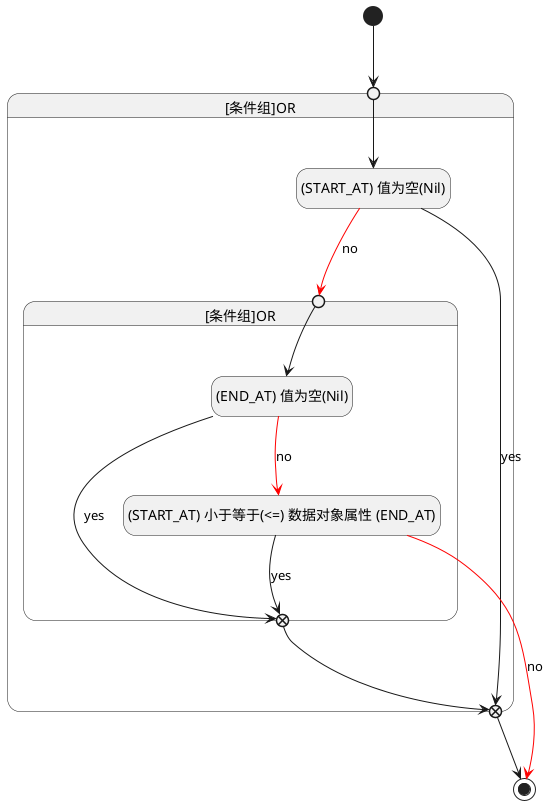

## 计划开始(START_AT) <!-- {docsify-ignore-all} -->

   

### 开始时间 :id=START_AT

```plantuml
@startuml
hide empty description
<style>
root {
  HyperlinkColor #42b983
}
</style>

state "start" as start  <<start>>
state "end" as end <<end>>
state "[条件组]OR" as 44a31819afa73713530aceafd679d9b6 [[$./start_at#a44a31819afa73713530aceafd679d9b6 {"[条件组]OR"}]] {
state " " as 44a31819afa73713530aceafd679d9b6_entry  <<entryPoint>>
state "(START_AT) 值为空(Nil)" as 978e33224291803608666acb448be8e8 [[$./start_at#a978e33224291803608666acb448be8e8 {"[常规条件] 值为空(Nil)"}]]
state "[条件组]OR" as d8239655a2b34f4a847aa8ba8b912ac5 [[$./start_at#ad8239655a2b34f4a847aa8ba8b912ac5 {"[条件组]OR"}]] {
state " " as d8239655a2b34f4a847aa8ba8b912ac5_entry  <<entryPoint>>
state "(END_AT) 值为空(Nil)" as 0dfe4aee984e79b9f1ee54e918cbca67 [[$./start_at#a0dfe4aee984e79b9f1ee54e918cbca67 {"[常规条件] 值为空(Nil)"}]]
state "(START_AT) 小于等于(<=) 数据对象属性 (END_AT)" as 7e8609a71533cb2e7bc6f1989ea2304b [[$./start_at#a7e8609a71533cb2e7bc6f1989ea2304b {"[常规条件] 小于等于(<=) 数据对象属性 (END_AT)"}]]
state " " as d8239655a2b34f4a847aa8ba8b912ac5_exit  <<exitPoint>>
}
state " " as 44a31819afa73713530aceafd679d9b6_exit  <<exitPoint>>
}


start --> 44a31819afa73713530aceafd679d9b6_entry 
44a31819afa73713530aceafd679d9b6_entry --> 978e33224291803608666acb448be8e8 
978e33224291803608666acb448be8e8 --> 44a31819afa73713530aceafd679d9b6_exit  : yes
978e33224291803608666acb448be8e8 -[#red]-> d8239655a2b34f4a847aa8ba8b912ac5_entry  : no

d8239655a2b34f4a847aa8ba8b912ac5_entry --> 0dfe4aee984e79b9f1ee54e918cbca67 
0dfe4aee984e79b9f1ee54e918cbca67 --> d8239655a2b34f4a847aa8ba8b912ac5_exit  : yes
0dfe4aee984e79b9f1ee54e918cbca67 -[#red]-> 7e8609a71533cb2e7bc6f1989ea2304b  : no

7e8609a71533cb2e7bc6f1989ea2304b --> d8239655a2b34f4a847aa8ba8b912ac5_exit  : yes
7e8609a71533cb2e7bc6f1989ea2304b -[#red]-> end  : no
d8239655a2b34f4a847aa8ba8b912ac5_exit --> 44a31819afa73713530aceafd679d9b6_exit 
44a31819afa73713530aceafd679d9b6_exit --> end 


@enduml
```

#### 条件说明

##### (START_AT) 小于等于(<=) 数据对象属性 (END_AT) :id=a7e8609a71533cb2e7bc6f1989ea2304b

`START_AT(计划开始)` LTANDEQ  `END_AT`

> [!ATTENTION|label:规则信息|icon:fa fa-warning]
> 开始时间必须小于等于发布时间

##### (END_AT) 值为空(Nil) :id=a0dfe4aee984e79b9f1ee54e918cbca67

`END_AT(计划结束)` ISNULL 

##### (START_AT) 值为空(Nil) :id=a978e33224291803608666acb448be8e8

`START_AT(计划开始)` ISNULL 

