## 获取模板数据 <!-- {docsify-ignore-all} -->

   

### 处理过程

```plantuml
@startuml
hide empty description
<style>
root {
  HyperlinkColor #42b983
}
</style>

hide empty description
state "开始" as Begin <<start>> [[$./get_form_stencil#begin {"开始"}]]
state "结束" as END1 <<end>> [[$./get_form_stencil#end1 {"结束"}]]
state "获取模板ID" as PREPAREPARAM2  [[$./get_form_stencil#prepareparam2 {"获取模板ID"}]]
state "实体行为" as DEACTION1  [[$./get_form_stencil#deaction1 {"实体行为"}]]
state "准备参数" as PREPAREPARAM1  [[$./get_form_stencil#prepareparam1 {"准备参数"}]]


Begin --> PREPAREPARAM2
PREPAREPARAM2 --> DEACTION1
DEACTION1 --> PREPAREPARAM1
PREPAREPARAM1 --> END1


@enduml
```

### 处理步骤说明

#### 开始 :id=Begin [开始]

*- N/A*
#### 结束 :id=END1 [结束]

返回 `page_info(页面信息)`

#### 获取模板ID :id=PREPAREPARAM2 [准备参数]

1. 将`Default(传入变量).stencil` 设置给  `stencil_info(模板信息).ID(标识)`

#### 实体行为 :id=DEACTION1 [实体行为]

调用实体 [页面模板(STENCIL)](module/Wiki/Stencil.md) 行为 [Get](module/Wiki/Stencil#行为) ，行为参数为`stencil_info(模板信息)`

将执行结果返回给参数`stencil_info(模板信息)`

#### 准备参数 :id=PREPAREPARAM1 [准备参数]

1. 将`stencil_info(模板信息).content(正文)` 设置给  `page_info(页面信息).content(正文)`
2. 将`stencil_info(模板信息).name(名称)` 设置给  `page_info(页面信息).Name(主题)`

### 实体逻辑参数

|    中文名   |    代码名    |  数据类型    |  实体   |备注 |
| --------| --------| -------- | -------- | --------   |
|传入变量(<i class="fa fa-check"/></i>)|Default|数据对象|[页面(PAGE)](module/Wiki/Article_page.md)||
|页面信息|page_info|数据对象|[页面(PAGE)](module/Wiki/Article_page.md)||
|模板信息|stencil_info|数据对象|[页面模板(STENCIL)](module/Wiki/Stencil.md)||
