## 显示模板 <!-- {docsify-ignore-all} -->

   

### 处理过程

```plantuml
@startuml
hide footbox
<style>
root {
  HyperlinkColor #42b983
}
</style>

hide empty description
state "开始" as Begin <<start>> [[$./show_stencil#begin {开始}]]
state "调试逻辑参数" as DEBUGPARAM1  [[$./show_stencil#debugparam1 {调试逻辑参数}]]
state "结束" as END1 <<end>> [[$./show_stencil#end1 {结束}]]
state "显示" as PREPAREJSPARAM2  [[$./show_stencil#preparejsparam2 {显示}]]
state "获取状态" as PREPAREJSPARAM1  [[$./show_stencil#preparejsparam1 {获取状态}]]
state "隐藏" as PREPAREJSPARAM3  [[$./show_stencil#preparejsparam3 {隐藏}]]


Begin --> DEBUGPARAM1
DEBUGPARAM1 --> PREPAREJSPARAM1
PREPAREJSPARAM1 --> PREPAREJSPARAM2 : [[$./show_stencil#preparejsparam1-preparejsparam2{已隐藏} 已隐藏]]
PREPAREJSPARAM2 --> END1
PREPAREJSPARAM1 --> PREPAREJSPARAM3 : [[$./show_stencil#preparejsparam1-preparejsparam3{已显示} 已显示]]
PREPAREJSPARAM3 --> END1


@enduml
```




### 处理步骤说明

#### 开始 :id=Begin


#### 调试逻辑参数 :id=DEBUGPARAM1


> [!NOTE|label:调试信息|icon:fa fa-bug]
> 调试输出参数`form`的详细信息

#### 结束 :id=END1


#### 显示 :id=PREPAREJSPARAM2


1. 将`true` 设置给  `state(分页容器状态).visible`

#### 获取状态 :id=PREPAREJSPARAM1


1. 将`form.details.tabpanel1.state` 设置给  `state(分页容器状态)`

#### 隐藏 :id=PREPAREJSPARAM3


1. 将`false` 设置给  `state(分页容器状态).visible`

### 连接条件说明
#### 已隐藏 :id=PREPAREJSPARAM1-PREPAREJSPARAM2

```state(分页容器状态).visible``` EQ ```false```
#### 已显示 :id=PREPAREJSPARAM1-PREPAREJSPARAM3

```state(分页容器状态).visible``` EQ ```true```


### 实体逻辑参数

|    中文名   |    代码名    |  数据类型      |备注 |
| --------| --------| --------  | --------   |
|view|view|当前视图对象||
|传入变量(<i class="fa fa-check"/></i>)|Default|数据对象||
|form|form|部件对象||
|分页容器状态|state|数据对象||
