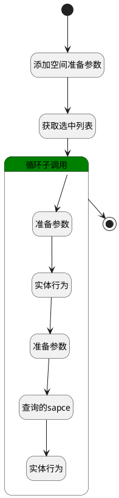

## 添加空间 <!-- {docsify-ignore-all} -->

   

### 处理过程

### 处理步骤说明

#### 开始 :id=Begin [开始]

*- N/A*
#### 添加空间准备参数 :id=DEBUGPARAM1 [调试逻辑参数]

> [!NOTE|label:调试信息|icon:fa fa-bug]
> 调试输出参数`Default(传入变量)`的详细信息

#### 获取选中列表 :id=PREPAREPARAM1 [准备参数]

1. 将`Default(传入变量).srfactionparam` 绑定给  `srfactionparam(所选空间列表)`

#### 循环子调用 :id=LOOPSUBCALL1 [循环子调用]

循环参数`srfactionparam(所选空间列表)`，子循环参数使用`for_temp_obj(循环临时变量)`
#### 准备参数 :id=PREPAREPARAM2 [准备参数]

1. 将`for_temp_obj(循环临时变量).ID(标识)` 设置给  `space_info(空间信息).ID(标识)`

#### 实体行为 :id=DEACTION2 [实体行为]

调用实体 [空间(SPACE)](module/Wiki/Space.md) 行为 [Get](module/Wiki/Space#行为) ，行为参数为`space_info(空间信息)`

将执行结果返回给参数`space_info(空间信息)`

#### 准备参数 :id=PREPAREPARAM3 [准备参数]

1. 将`Default(传入变量).category` 设置给  `space_info(空间信息).CATEGORY_ID(分类)`

#### 查询的sapce :id=DEBUGPARAM3 [调试逻辑参数]

> [!NOTE|label:调试信息|icon:fa fa-bug]
> 调试输出参数`space_info(空间信息)`的详细信息

#### 实体行为 :id=DEACTION1 [实体行为]

调用实体 [空间(SPACE)](module/Wiki/Space.md) 行为 [Update](module/Wiki/Space#行为) ，行为参数为`space_info(空间信息)`

#### 结束 :id=END1 [结束]

*- N/A*

### 实体逻辑参数

|    中文名   |    代码名    |  数据类型    |  实体   |备注 |
| --------| --------| -------- | -------- | --------   |
|传入变量(<i class="fa fa-check"/></i>)|Default|数据对象|[空间(SPACE)](module/Wiki/Space.md)||
|循环临时变量|for_temp_obj|数据对象|[空间(SPACE)](module/Wiki/Space.md)||
|空间信息|space_info|数据对象|[空间(SPACE)](module/Wiki/Space.md)||
|所选空间列表|srfactionparam|数据对象列表|[空间(SPACE)](module/Wiki/Space.md)||
