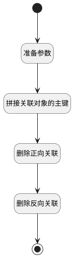

## 取消关联 <!-- {docsify-ignore-all} -->

   

### 处理过程




### 处理步骤说明

#### 开始 :id=Begin<sup class="footnote-symbol"> <font color=gray size=1>[开始]</font></sup>


*- N/A*
#### 准备参数 :id=PREPAREPARAM1<sup class="footnote-symbol"> <font color=gray size=1>[准备参数]</font></sup>


1. 将`Default(传入变量).principal_id` 设置给  `relationobj(正向关联对象).PRINCIPAL_ID(关联主体标识)`
2. 将`Default(传入变量).principal_id` 设置给  `relationobj2(反向关联对象).TARGET_ID(关联目标标识)`
3. 将`Default(传入变量).ID(标识)` 设置给  `relationobj2(反向关联对象).PRINCIPAL_ID(关联主体标识)`
4. 将`Default(传入变量).ID(标识)` 设置给  `relationobj(正向关联对象).TARGET_ID(关联目标标识)`

#### 拼接关联对象的主键 :id=RAWSFCODE1<sup class="footnote-symbol"> <font color=gray size=1>[直接后台代码]</font></sup>


<p class="panel-title"><b>执行代码[JavaScript]</b></p>

```groovy
var relationobj = logic.getParam("relationobj");
if(relationobj.get("principal_id") != null && relationobj.get("target_id") != null){
    relationobj.set("id", relationobj.get("principal_id") + "_" + relationobj.get("target_id"));
}
var relationobj2 = logic.getParam("relationobj2");
if(relationobj2.get("principal_id") != null && relationobj2.get("target_id") != null){
    relationobj2.set("id", relationobj2.get("principal_id") + "_" + relationobj2.get("target_id"));
}

```

#### 删除正向关联 :id=DEACTION2<sup class="footnote-symbol"> <font color=gray size=1>[实体行为]</font></sup>


调用实体 [关联(RELATION)](module/Base/Relation.md) 行为 [Remove](module/Base/Relation#行为) ，行为参数为`relationobj(正向关联对象)`

#### 删除反向关联 :id=DEACTION3<sup class="footnote-symbol"> <font color=gray size=1>[实体行为]</font></sup>


调用实体 [关联(RELATION)](module/Base/Relation.md) 行为 [Remove](module/Base/Relation#行为) ，行为参数为`relationobj2(反向关联对象)`

#### 结束 :id=END1<sup class="footnote-symbol"> <font color=gray size=1>[结束]</font></sup>


*- N/A*


### 实体逻辑参数

|    中文名   |    代码名    |  数据类型    |  实体   |备注 |
| --------| --------| -------- | -------- | --------   |
|传入变量(<i class="fa fa-check"/></i>)|Default|数据对象|[空间(SPACE)](module/Wiki/Space.md)||
|正向关联对象|relationobj|数据对象|[关联(RELATION)](module/Base/Relation.md)||
|反向关联对象|relationobj2|数据对象|[关联(RELATION)](module/Base/Relation.md)||
