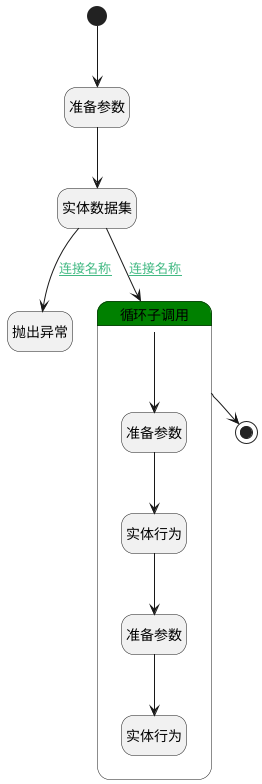

## AI创建页面 <!-- {docsify-ignore-all} -->

   

### 处理过程

### 处理步骤说明

#### 开始 :id=Begin [开始]

*- N/A*
#### 准备参数 :id=PREPAREPARAM2 [准备参数]

1. 将`Default(传入变量).project` 设置给  `filter.N_PRINCIPAL_ID_EQ`
2. 将`space` 设置给  `filter.N_TARGET_TYPE_EQ`
3. 将`main_space` 设置给  `filter.N_RELATION_TYPE_EQ`

#### 实体数据集 :id=DEDATASET1 [实体数据集]

调用实体 [关联(RELATION)](module/Base/relation.md) 数据集合 [数据集(DEFAULT)](module/Base/relation#数据集合) ，查询参数为`filter`

将执行结果返回给参数`relation_page`

#### 抛出异常 :id=THROWEXCEPTION1 [抛出异常]

> [!ATTENTION|label:抛出异常|icon:fa fa-warning]
> 错误信息：知识页面创建失败，原因：未标记项目的主知识库

#### 循环子调用 :id=LOOPSUBCALL1 [循环子调用]

循环参数`relation_page`，子循环参数使用`temp`
#### 准备参数 :id=PREPAREPARAM3 [准备参数]

1. 将`temp.TARGET_ID(目标主体标识)` 设置给  `space.ID(标识)`

#### 实体行为 :id=DEACTION2 [实体行为]

调用实体 [空间(SPACE)](module/Wiki/space.md) 行为 [Get](module/Wiki/space#行为) ，行为参数为`space`

将执行结果返回给参数`space`

#### 准备参数 :id=PREPAREPARAM1 [准备参数]

1. 将`MD` 设置给  `page.FORMAT_TYPE(正文格式)`
2. 将`空值（NULL）` 设置给  `page.IDENTIFIER(编号)`
3. 将`空值（NULL）` 设置给  `page.ID(标识)`
4. 将`0` 设置给  `page.IS_ARCHIVED(是否已归档)`
5. 将`0` 设置给  `page.IS_DELETED(是否已删除)`
6. 将`1` 设置给  `page.IS_LEAF(是否叶子节点)`
7. 将`0` 设置给  `page.IS_LOCK(是否锁定)`
8. 将`0` 设置给  `page.IS_PUBLISHED(是否发布)`
9. 将`0` 设置给  `page.IS_SHARED(是否开启共享)`
10. 将`0` 设置给  `page.IS_SHARED_SUBSET(是否同时共享子页面)`
11. 将`Default(传入变量).name(主题)` 设置给  `page.NAME(主题)`
12. 将`0` 设置给  `page.PUBLISHED(发布状态)`
13. 将`1` 设置给  `page.REVIEW_RESULT_STATE(评审结果)`
14. 将`space.ID(标识)` 设置给  `page.SPACE_ID(空间标识)`
15. 将`Default(传入变量).name(主题)` 设置给  `page.title`
16. 将`1` 设置给  `page.TYPE(类型)`
17. 将`Default(传入变量).content(正文)` 设置给  `page.CONTENT(正文)`

#### 实体行为 :id=DEACTION1 [实体行为]

调用实体 [页面(PAGE)](module/Wiki/article_page.md) 行为 [发布页面(publish_page)](module/Wiki/article_page#行为) ，行为参数为`page`

#### 结束 :id=END1 [结束]

*- N/A*

### 连接条件说明
#### 连接名称 :id=DEDATASET1-LOOPSUBCALL1

`relation_page(relation_page).size` NOTEQ `0`
#### 连接名称 :id=DEDATASET1-THROWEXCEPTION1

`relation_page(relation_page).size` EQ `0`

### 实体逻辑参数

|    中文名   |    代码名    |  数据类型    |  实体   |备注 |
| --------| --------| -------- | -------- | --------   |
|传入变量(<i class="fa fa-check"/></i>)|Default|数据对象|[页面(PAGE)](module/Wiki/article_page.md)||
|filter|filter|过滤器|||
|page|page|数据对象|[页面(PAGE)](module/Wiki/article_page.md)||
|relation_page|relation_page|分页查询|||
|space|space|数据对象|[空间(SPACE)](module/Wiki/space.md)||
|temp|temp|数据对象|[关联(RELATION)](module/Base/relation.md)||
