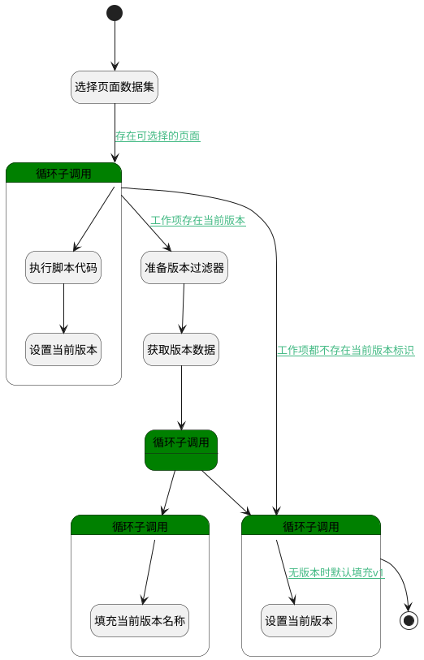

## 基线规划页面数据查询 <!-- {docsify-ignore-all} -->

   基线规划工作项时，填充页面当前版本名称

### 处理过程




### 处理步骤说明

#### 开始 :id=Begin<sup class="footnote-symbol"> <font color=gray size=1>[开始]</font></sup>


*- N/A*
#### 选择页面数据集 :id=DEDATASET1<sup class="footnote-symbol"> <font color=gray size=1>[实体数据集]</font></sup>


调用实体 [页面(PAGE)](module/Wiki/article_page.md) 数据集合 [基线选择页面(baseline_choose_page)](module/Wiki/article_page#数据集合) ，查询参数为`Default(传入变量)`

将执行结果返回给参数`page(分页查询结果变量)`

#### 循环子调用 :id=LOOPSUBCALL1<sup class="footnote-symbol"> <font color=gray size=1>[循环子调用]</font></sup>


循环参数`page(分页查询结果变量)`，子循环参数使用`for_temp_obj(循环临时变量)`
#### 执行脚本代码 :id=RAWSFCODE1<sup class="footnote-symbol"> <font color=gray size=1>[直接后台代码]</font></sup>


<p class="panel-title"><b>执行代码[JavaScript]</b></p>

```javascript
var page_versions = logic.getParam("page_versions");
var for_temp_obj = logic.getParam("for_temp_obj");
if(for_temp_obj.get("cur_version_id")){
    var version_id_in = page_versions.get("version_id_in");
    if(version_id_in){
        version_id_in = version_id_in + "," + for_temp_obj.get("cur_version_id");
    } else {
        version_id_in = for_temp_obj.get("cur_version_id");
    }
    page_versions.set("version_id_in", version_id_in);
}
```

#### 设置当前版本 :id=PREPAREPARAM4<sup class="footnote-symbol"> <font color=gray size=1>[准备参数]</font></sup>


1. 将`空值（NULL）` 设置给  `for_temp_obj(循环临时变量).CUR_VERSION_NAME(当前版本名称)`

#### 准备版本过滤器 :id=PREPAREPARAM1<sup class="footnote-symbol"> <font color=gray size=1>[准备参数]</font></sup>


1. 将`page_versions(临时存放版本标识).version_id_in` 设置给  `version_filter(版本过滤器).n_id_in`

#### 获取版本数据 :id=DEDATASET2<sup class="footnote-symbol"> <font color=gray size=1>[实体数据集]</font></sup>


调用实体 [版本(VERSION)](module/Base/version.md) 数据集合 [数据集(DEFAULT)](module/Base/version#数据集合) ，查询参数为`version_filter(版本过滤器)`

将执行结果返回给参数`version_page(分页查询结果变量)`

#### 循环子调用 :id=LOOPSUBCALL2<sup class="footnote-symbol"> <font color=gray size=1>[循环子调用]</font></sup>


循环参数`version_page(分页查询结果变量)`，子循环参数使用`for_temp_version_obj(版本循环临时变量)`
#### 循环子调用 :id=LOOPSUBCALL3<sup class="footnote-symbol"> <font color=gray size=1>[循环子调用]</font></sup>


循环参数`page(分页查询结果变量)`，子循环参数使用`for_temp_obj(循环临时变量)`
#### 填充当前版本名称 :id=PREPAREPARAM2<sup class="footnote-symbol"> <font color=gray size=1>[准备参数]</font></sup>


1. 将`for_temp_version_obj(版本循环临时变量).NAME(名称)` 设置给  `for_temp_obj(循环临时变量).CUR_VERSION_NAME(当前版本名称)`

#### 循环子调用 :id=LOOPSUBCALL4<sup class="footnote-symbol"> <font color=gray size=1>[循环子调用]</font></sup>


循环参数`page(分页查询结果变量)`，子循环参数使用`for_temp_obj(循环临时变量)`
#### 设置当前版本 :id=PREPAREPARAM3<sup class="footnote-symbol"> <font color=gray size=1>[准备参数]</font></sup>


1. 将`v1` 设置给  `for_temp_obj(循环临时变量).CUR_VERSION_NAME(当前版本名称)`

#### 结束 :id=END1<sup class="footnote-symbol"> <font color=gray size=1>[结束]</font></sup>


返回 `page(分页查询结果变量)`


### 连接条件说明
#### 存在可选择的页面 :id=DEDATASET1-LOOPSUBCALL1

`page(分页查询结果变量)` GT `0`
#### 工作项存在当前版本 :id=LOOPSUBCALL1-PREPAREPARAM1

`page_versions(临时存放版本标识).version_id_in` ISNOTNULL
#### 若版本标识与页面的当前版本一致 


#### 无版本时默认填充v1 :id=LOOPSUBCALL4-PREPAREPARAM3

`for_temp_obj(循环临时变量).CUR_VERSION_NAME(当前版本名称)` ISNULL
#### 工作项都不存在当前版本标识 :id=LOOPSUBCALL1-LOOPSUBCALL4

`page_versions(临时存放版本标识).version_id_in` ISNULL


### 实体逻辑参数

|    中文名   |    代码名    |  数据类型    |  实体   |备注 |
| --------| --------| -------- | -------- | --------   |
|传入变量(<i class="fa fa-check"/></i>)|Default|过滤器|||
|循环临时变量|for_temp_obj|数据对象|[页面(PAGE)](module/Wiki/article_page.md)||
|版本循环临时变量|for_temp_version_obj|数据对象|[版本(VERSION)](module/Base/version.md)||
|分页查询结果变量|page|分页查询|||
|临时存放版本标识|page_versions|数据对象|[页面(PAGE)](module/Wiki/article_page.md)||
|版本过滤器|version_filter|过滤器|||
|分页查询结果变量|version_page|分页查询|||
