## 生成版本 <!-- {docsify-ignore-all} -->

   

### 处理过程

```plantuml
@startuml
hide empty description
<style>
root {
  HyperlinkColor #42b983
}
</style>

hide empty description
state "开始" as Begin <<start>> [[$./commit_version#begin {"开始"}]]
state "结束" as END1 <<end>> [[$./commit_version#end1 {"结束"}]]
state "准备版本信息" as PREPARE_PARAM1  [[$./commit_version#prepare_param1 {"准备版本信息"}]]
state "建立版本" as COMMIT_VERSION  [[$./commit_version#commit_version {"建立版本"}]]


Begin --> PREPARE_PARAM1 : [[$./commit_version#begin-prepare_param1{已发布} 已发布]]
PREPARE_PARAM1 --> COMMIT_VERSION : [[$./commit_version#prepare_param1-commit_version{连接名称} 连接名称]]
COMMIT_VERSION --> END1


@enduml
```

### 处理步骤说明

#### 开始 :id=Begin [开始]

*- N/A*
#### 结束 :id=END1 [结束]

*- N/A*

#### 准备版本信息 :id=PREPARE_PARAM1 [准备参数]

1. 将`Default(传入变量).ID(标识)` 设置给  `version(版本).OWNER_ID(所属数据标识)`
2. 将`PAGE` 设置给  `version(版本).OWNER_TYPE(所属数据对象)`

#### 建立版本 :id=COMMIT_VERSION [实体行为]

调用实体 [版本(VERSION)](module/Base/version.md) 行为 [提交版本(COMMIT)](module/Base/version#行为) ，行为参数为`version(版本)`

### 连接条件说明
#### 已发布 :id=Begin-PREPARE_PARAM1

`Default(传入变量).IS_PUBLISHED(是否发布)` EQ `1` AND `last(last).IS_PUBLISHED(是否发布)` EQ `1`
#### 连接名称 :id=PREPARE_PARAM1-COMMIT_VERSION

( OR  OR  OR )

### 实体逻辑参数

|    中文名   |    代码名    |  数据类型    |  实体   |备注 |
| --------| --------| -------- | -------- | --------   |
|传入变量(<i class="fa fa-check"/></i>)|Default|数据对象|[页面(PAGE)](module/Wiki/article_page.md)||
|last|last|最后数据变量|||
|版本|version|数据对象|[版本(VERSION)](module/Base/version.md)||
