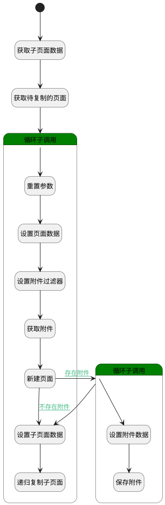

## 复制子页面 <!-- {docsify-ignore-all} -->

   复制页面时调用

### 处理过程




### 处理步骤说明

#### 开始 :id=Begin<sup class="footnote-symbol"> <font color=gray size=1>[开始]</font></sup>


*- N/A*
#### 获取子页面数据 :id=PREPAREPARAM1<sup class="footnote-symbol"> <font color=gray size=1>[准备参数]</font></sup>


1. 将`Default(传入变量).old_parent_id` 绑定给  `old_parent_id(复制父页面id)`
2. 将`Default(传入变量).old_parent_id` 设置给  `page_filter(页面过滤器).N_PARENT_ID_EQ`
3. 将`Default(传入变量).new_parent_id` 绑定给  `new_parent_id(目标父页面id)`
4. 将`Default(传入变量).new_space_id` 绑定给  `new_space_id(目标空间id)`

#### 获取待复制的页面 :id=DEDATASET1<sup class="footnote-symbol"> <font color=gray size=1>[实体数据集]</font></sup>


调用实体 [页面(PAGE)](module/Wiki/article_page.md) 数据集合 [正常(normal)](module/Wiki/article_page#数据集合) ，查询参数为`page_filter(页面过滤器)`

将执行结果返回给参数`old_pages(待复制页面分页结果)`

#### 循环子调用 :id=LOOPSUBCALL1<sup class="footnote-symbol"> <font color=gray size=1>[循环子调用]</font></sup>


循环参数`old_pages(待复制页面分页结果)`，子循环参数使用`for_tmp_obj(循环变量)`
#### 重置参数 :id=RESETPARAM1<sup class="footnote-symbol"> <font color=gray size=1>[重置参数]</font></sup>


重置参数```page_obj(页面)```
#### 设置页面数据 :id=PREPAREPARAM2<sup class="footnote-symbol"> <font color=gray size=1>[准备参数]</font></sup>


1. 将`for_tmp_obj(循环变量).FORMAT_TYPE(正文格式)` 设置给  `page_obj(页面).FORMAT_TYPE(正文格式)`
2. 将`用户全局对象.srfpersonid` 设置给  `page_obj(页面).PUBLISH_MAN(发布人)`
3. 将`计算式 null` 设置给  `page_obj(页面).PUBLISH_TIME(发布时间)`
4. 将`new_parent_id(目标父页面id)` 设置给  `page_obj(页面).PARENT_ID(父页面标识)`
5. 将`new_space_id(目标空间id)` 设置给  `page_obj(页面).SPACE_ID(空间标识)`
6. 将`for_tmp_obj(循环变量).IS_PUBLISHED(是否发布)` 设置给  `page_obj(页面).IS_PUBLISHED(是否发布)`
7. 将`for_tmp_obj(循环变量).PUBLISHED(发布状态)` 设置给  `page_obj(页面).PUBLISHED(发布状态)`
8. 将`for_tmp_obj(循环变量).IS_DELETED(是否已删除)` 设置给  `page_obj(页面).IS_DELETED(是否已删除)`
9. 将`for_tmp_obj(循环变量).PUBLISH_CONTENT(发布正文)` 设置给  `page_obj(页面).PUBLISH_CONTENT(发布正文)`
10. 将`for_tmp_obj(循环变量).TYPE(类型)` 设置给  `page_obj(页面).TYPE(类型)`
11. 将`for_tmp_obj(循环变量).IS_ARCHIVED(是否已归档)` 设置给  `page_obj(页面).IS_ARCHIVED(是否已归档)`
12. 将`for_tmp_obj(循环变量).IS_LOCK(是否锁定)` 设置给  `page_obj(页面).IS_LOCK(是否锁定)`
13. 将`for_tmp_obj(循环变量).PUBLISH_NAME(发布主题)` 设置给  `page_obj(页面).PUBLISH_NAME(发布主题)`
14. 将`for_tmp_obj(循环变量).CONTENT(正文)` 设置给  `page_obj(页面).CONTENT(正文)`
15. 将`for_tmp_obj(循环变量).NAME(主题)` 设置给  `page_obj(页面).NAME(主题)`
16. 将`for_tmp_obj(循环变量).IS_LEAF(是否叶子节点)` 设置给  `page_obj(页面).IS_LEAF(是否叶子节点)`
17. 将`for_tmp_obj(循环变量).ATTACHMENTS(附件)` 绑定给  `attachments(附件)`

#### 设置附件过滤器 :id=PREPAREPARAM5<sup class="footnote-symbol"> <font color=gray size=1>[准备参数]</font></sup>


1. 将`for_tmp_obj(循环变量).ID(标识)` 设置给  `attachment_filter(附近过滤器).N_OWNER_ID_EQ`

#### 获取附件 :id=DEDATASET2<sup class="footnote-symbol"> <font color=gray size=1>[实体数据集]</font></sup>


调用实体 [附件(ATTACHMENT)](module/Base/attachment.md) 数据集合 [数据集(DEFAULT)](module/Base/attachment#数据集合) ，查询参数为`attachment_filter(附近过滤器)`

将执行结果返回给参数`attachments(附件)`

#### 新建页面 :id=DEACTION1<sup class="footnote-symbol"> <font color=gray size=1>[实体行为]</font></sup>


调用实体 [页面(PAGE)](module/Wiki/article_page.md) 行为 [Create](module/Wiki/article_page#行为) ，行为参数为`page_obj(页面)`

将执行结果返回给参数`page_obj(页面)`

#### 循环子调用 :id=LOOPSUBCALL2<sup class="footnote-symbol"> <font color=gray size=1>[循环子调用]</font></sup>


循环参数`attachments(附件)`，子循环参数使用`attachment(附件)`
#### 设置附件数据 :id=PREPAREPARAM3<sup class="footnote-symbol"> <font color=gray size=1>[准备参数]</font></sup>


1. 将`空值（NULL）` 设置给  `attachment(附件).ID(标识)`
2. 将`page_obj(页面).ID(标识)` 设置给  `attachment(附件).OWNER_ID(所属数据标识)`
3. 将`PAGE` 设置给  `attachment(附件).OWNER_TYPE(所属数据对象)`

#### 保存附件 :id=DEACTION2<sup class="footnote-symbol"> <font color=gray size=1>[实体行为]</font></sup>


调用实体 [附件(ATTACHMENT)](module/Base/attachment.md) 行为 [Create](module/Base/attachment#行为) ，行为参数为`attachment(附件)`

#### 设置子页面数据 :id=PREPAREPARAM4<sup class="footnote-symbol"> <font color=gray size=1>[准备参数]</font></sup>


1. 将`page_obj(页面).ID(标识)` 设置给  `child_data(子页面复制数据).new_parent_id`
2. 将`for_tmp_obj(循环变量).ID(标识)` 设置给  `child_data(子页面复制数据).old_parent_id`
3. 将`new_space_id(目标空间id)` 设置给  `child_data(子页面复制数据).new_space_id`

#### 递归复制子页面 :id=DELOGIC1<sup class="footnote-symbol"> <font color=gray size=1>[实体逻辑]</font></sup>


调用实体 [页面(PAGE)](module/Wiki/article_page.md) 处理逻辑 [复制子页面]((module/Wiki/article_page/logic/copy_child_page.md)) ，行为参数为`child_data(子页面复制数据)`


### 连接条件说明
#### 存在附件 :id=DEACTION1-LOOPSUBCALL2

`attachments(附件)` ISNOTNULL
#### 不存在附件 :id=DEACTION1-PREPAREPARAM4

`attachments(附件)` ISNULL


### 实体逻辑参数

|    中文名   |    代码名    |  数据类型    |  实体   |备注 |
| --------| --------| -------- | -------- | --------   |
|传入变量(<i class="fa fa-check"/></i>)|Default|数据对象|[页面(PAGE)](module/Wiki/article_page.md)||
|附件|attachment|数据对象|[附件(ATTACHMENT)](module/Base/attachment.md)||
|附近过滤器|attachment_filter|过滤器|||
|附件|attachments|分页查询|||
|子页面复制数据|child_data|数据对象|||
|子页面|child_pages|数据对象列表|[页面(PAGE)](module/Wiki/article_page.md)||
|循环变量|for_tmp_obj|数据对象|[页面(PAGE)](module/Wiki/article_page.md)||
|目标父页面id|new_parent_id|简单数据|||
|目标空间id|new_space_id|简单数据|||
|待复制页面分页结果|old_pages|分页查询|||
|复制父页面id|old_parent_id|简单数据|||
|页面过滤器|page_filter|过滤器|||
|页面|page_obj|数据对象|[页面(PAGE)](module/Wiki/article_page.md)||
