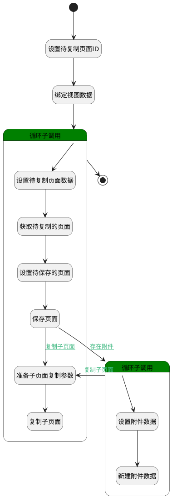

## 复制页面 <!-- {docsify-ignore-all} -->

   复制页面，会调用复制子页面处理逻辑

### 处理过程

### 处理步骤说明

#### 开始 :id=Begin [开始]

*- N/A*
#### 设置待复制页面ID :id=PREPAREPARAM1 [准备参数]

1. 将`Default(传入变量).id(标识)` 绑定给  `page_id(待复制页面id)`

#### 绑定视图数据 :id=BINDPARAM1 [绑定参数]

绑定参数`Default(传入变量)` 到 `srfactionparam(视图数据)`
#### 循环子调用 :id=LOOPSUBCALL1 [循环子调用]

循环参数`srfactionparam(视图数据)`，子循环参数使用`for_tmp_obj(循环变量)`
#### 设置待复制页面数据 :id=PREPAREPARAM2 [准备参数]

1. 将`for_tmp_obj(循环变量).parent_id(父页面标识)` 绑定给  `target_page_id(目标页面id)`
2. 将`for_tmp_obj(循环变量).space_id(空间标识)` 绑定给  `target_space_id(目标空间id)`
3. 将`for_tmp_obj(循环变量).is_child` 绑定给  `is_child(是否包含子页面)`

#### 获取待复制的页面 :id=DEACTION1 [实体行为]

调用实体 [页面(PAGE)](module/Wiki/article_page.md) 行为 [Get](module/Wiki/article_page#行为) ，行为参数为`page_id(待复制页面id)`

将执行结果返回给参数`for_tmp_obj(循环变量)`

#### 设置待保存的页面 :id=PREPAREPARAM3 [准备参数]

1. 将`for_tmp_obj(循环变量).FORMAT_TYPE(正文格式)` 设置给  `page_obj(页面对象).FORMAT_TYPE(正文格式)`
2. 将`计算式 null` 设置给  `page_obj(页面对象).PUBLISH_TIME(发布时间)`
3. 将`用户全局对象.srfpersonid` 设置给  `page_obj(页面对象).PUBLISH_MAN(发布人)`
4. 将`for_tmp_obj(循环变量).IS_PUBLISHED(是否发布)` 设置给  `page_obj(页面对象).IS_PUBLISHED(是否发布)`
5. 将`for_tmp_obj(循环变量).PUBLISHED(发布状态)` 设置给  `page_obj(页面对象).PUBLISHED(发布状态)`
6. 将`for_tmp_obj(循环变量).IS_DELETED(是否已删除)` 设置给  `page_obj(页面对象).IS_DELETED(是否已删除)`
7. 将`for_tmp_obj(循环变量).PUBLISH_CONTENT(发布正文)` 设置给  `page_obj(页面对象).PUBLISH_CONTENT(发布正文)`
8. 将`for_tmp_obj(循环变量).TYPE(类型)` 设置给  `page_obj(页面对象).TYPE(类型)`
9. 将`for_tmp_obj(循环变量).IS_ARCHIVED(是否已归档)` 设置给  `page_obj(页面对象).IS_ARCHIVED(是否已归档)`
10. 将`for_tmp_obj(循环变量).IS_LOCK(是否锁定)` 设置给  `page_obj(页面对象).IS_LOCK(是否锁定)`
11. 将`for_tmp_obj(循环变量).PUBLISH_NAME(发布主题)` 设置给  `page_obj(页面对象).PUBLISH_NAME(发布主题)`
12. 将`for_tmp_obj(循环变量).CONTENT(正文)` 设置给  `page_obj(页面对象).CONTENT(正文)`
13. 将`target_space_id(目标空间id)` 设置给  `page_obj(页面对象).SPACE_ID(空间标识)`
14. 将`target_page_id(目标页面id)` 设置给  `page_obj(页面对象).PARENT_ID(父页面标识)`
15. 将`for_tmp_obj(循环变量).NAME(主题)` 设置给  `page_obj(页面对象).NAME(主题)`
16. 将`for_tmp_obj(循环变量).IS_LEAF(是否叶子节点)` 设置给  `page_obj(页面对象).IS_LEAF(是否叶子节点)`
17. 将`for_tmp_obj(循环变量).ATTACHMENTS(附件)` 绑定给  `attachments(附件)`

#### 保存页面 :id=DEACTION2 [实体行为]

调用实体 [页面(PAGE)](module/Wiki/article_page.md) 行为 [Create](module/Wiki/article_page#行为) ，行为参数为`page_obj(页面对象)`

将执行结果返回给参数`page_obj(页面对象)`

#### 循环子调用 :id=LOOPSUBCALL2 [循环子调用]

循环参数`attachments(附件)`，子循环参数使用`attachment(附件)`
#### 设置附件数据 :id=PREPAREPARAM4 [准备参数]

1. 将`空值（NULL）` 设置给  `attachment(附件).ID(标识)`
2. 将`page_obj(页面对象).ID(标识)` 设置给  `attachment(附件).OWNER_ID(所属数据标识)`
3. 将`PAGE` 设置给  `attachment(附件).OWNER_TYPE(所属数据对象)`

#### 新建附件数据 :id=DEACTION3 [实体行为]

调用实体 [附件(ATTACHMENT)](module/Base/attachment.md) 行为 [Create](module/Base/attachment#行为) ，行为参数为`attachment(附件)`

#### 结束 :id=END1 [结束]

*- N/A*

#### 准备子页面复制参数 :id=PREPAREPARAM5 [准备参数]

1. 将`page_id(待复制页面id)` 设置给  `child_data(子页面复制参数).old_parent_id`
2. 将`page_obj(页面对象).ID(标识)` 设置给  `child_data(子页面复制参数).new_parent_id`
3. 将`target_space_id(目标空间id)` 设置给  `child_data(子页面复制参数).new_space_id`

#### 复制子页面 :id=DELOGIC1 [实体逻辑]

调用实体 [页面(PAGE)](module/Wiki/article_page.md) 处理逻辑 [复制子页面]((module/Wiki/article_page/logic/copy_child_page.md)) ，行为参数为`child_data(子页面复制参数)`

### 连接条件说明
#### 存在附件 :id=DEACTION2-LOOPSUBCALL2

`attachments(附件)` ISNOTNULL
#### 复制子页面 :id=LOOPSUBCALL2-PREPAREPARAM5

`is_child(是否包含子页面)` EQ `1`
#### 复制子页面 :id=DEACTION2-PREPAREPARAM5

`is_child(是否包含子页面)` EQ `1`

### 实体逻辑参数

|    中文名   |    代码名    |  数据类型    |  实体   |备注 |
| --------| --------| -------- | -------- | --------   |
|传入变量(<i class="fa fa-check"/></i>)|Default|数据对象|[页面(PAGE)](module/Wiki/article_page.md)||
|附件|attachment|数据对象|[附件(ATTACHMENT)](module/Base/attachment.md)||
|附件|attachments|数据对象列表|[附件(ATTACHMENT)](module/Base/attachment.md)||
|子页面复制参数|child_data|数据对象|||
|循环变量|for_tmp_obj|数据对象|[页面(PAGE)](module/Wiki/article_page.md)||
|是否包含子页面|is_child|简单数据|||
|待复制页面id|page_id|简单数据|||
|页面对象|page_obj|数据对象|[页面(PAGE)](module/Wiki/article_page.md)||
|视图数据|srfactionparam|数据对象列表|||
|目标页面id|target_page_id|简单数据|||
|目标空间id|target_space_id|简单数据|||
