## 统计页面评论数 <!-- {docsify-ignore-all} -->

   统计页面评论数

### 处理过程

```plantuml
@startuml
hide empty description
<style>
root {
  HyperlinkColor #42b983
}
</style>

hide empty description
state "开始" as Begin <<start>> [[$./count_comment#begin {"开始"}]]
state "结束" as END1 <<end>> [[$./count_comment#end1 {"结束"}]]
state "统计页面评论数" as RAWSQLCALL1  [[$./count_comment#rawsqlcall1 {"统计页面评论数"}]]


Begin --> RAWSQLCALL1
RAWSQLCALL1 --> END1


@enduml
```




### 处理步骤说明

#### 开始 :id=Begin<sup class="footnote-symbol"> <font color=gray size=1>[开始]</font></sup>


*- N/A*
#### 结束 :id=END1<sup class="footnote-symbol"> <font color=gray size=1>[结束]</font></sup>


返回 `comment_num(评论数)`

#### 统计页面评论数 :id=RAWSQLCALL1<sup class="footnote-symbol"> <font color=gray size=1>[直接SQL调用]</font></sup>


<p class="panel-title"><b>执行sql语句</b></p>

```sql
SELECT COUNT(*) AS total FROM `comment` WHERE PRINCIPAL_TYPE = 'PAGE' AND CONTENT <> '<p><del>该评论已删除</del></p>' AND PRINCIPAL_ID = ?
```

<p class="panel-title"><b>执行sql参数</b></p>

1. `Default(传入变量).article_page`

将执行sql结果赋值给参数`comment_num(评论数)`


### 实体逻辑参数

|    中文名   |    代码名    |  数据类型    |  实体   |备注 |
| --------| --------| -------- | -------- | --------   |
|传入变量(<i class="fa fa-check"/></i>)|Default|数据对象|[页面(PAGE)](module/Wiki/article_page.md)||
|评论数|comment_num|数据对象|||
