## 导出页面为pdf <!-- {docsify-ignore-all} -->

   导出页面为pdf

### 处理过程

```plantuml
@startuml
hide empty description
<style>
root {
  HyperlinkColor #42b983
}
</style>

hide empty description
state "开始" as Begin <<start>> [[$./export_to_pdf#begin {"开始"}]]
state "获取页面信息" as DEACTION1  [[$./export_to_pdf#deaction1 {"获取页面信息"}]]
state "结束" as END1 <<end>> [[$./export_to_pdf#end1 {"结束"}]]
state "服务插件" as SFPLUGIN1  [[$./export_to_pdf#sfplugin1 {"服务插件"}]]


Begin --> DEACTION1
DEACTION1 --> SFPLUGIN1
SFPLUGIN1 --> END1


@enduml
```

### 处理步骤说明

#### 开始 :id=Begin [开始]

*- N/A*
#### 获取页面信息 :id=DEACTION1 [实体行为]

调用实体 [页面(PAGE)](module/Wiki/article_page.md) 行为 [Get](module/Wiki/article_page#行为) ，行为参数为`Default(传入变量)`

将执行结果返回给参数`Default(传入变量)`

#### 结束 :id=END1 [结束]

返回 `web_response`

#### 服务插件 :id=SFPLUGIN1 [系统服务插件]
> 使用插件：[HtmlToPdfTransRuntime](index/sfplugin_index#usrsfplugin0612360832)

调用插件 [HtmlToPdfTransRuntime](index/sfplugin_index#usrsfplugin0612360832)

### 实体逻辑参数

|    中文名   |    代码名    |  数据类型    |  实体   |备注 |
| --------| --------| -------- | -------- | --------   |
|传入变量(<i class="fa fa-check"/></i>)|Default|数据对象|[页面(PAGE)](module/Wiki/article_page.md)||
|pdf文件|pdf_file|文件对象|||
|web_response|web_response||||
