## 完成关注 <!-- {docsify-ignore-all} -->

   

### 处理过程

```plantuml
@startuml
hide empty description
<style>
root {
  HyperlinkColor #42b983
}
</style>

hide empty description
state "开始" as Begin <<start>> [[$./finish_add_attention#begin {"开始"}]]
state "获取列表" as BINDPARAM1  [[$./finish_add_attention#bindparam1 {"获取列表"}]]
state "结束" as END1 <<end>> [[$./finish_add_attention#end1 {"结束"}]]
state "循环子调用" as LOOPSUBCALL1  [[$./finish_add_attention#loopsubcall1 {"循环子调用"}]] #green {
state "设置参数" as PREPAREPARAM1  [[$./finish_add_attention#prepareparam1 {"设置参数"}]]
state "创建关注人" as DEACTION1  [[$./finish_add_attention#deaction1 {"创建关注人"}]]
}


Begin --> BINDPARAM1
BINDPARAM1 --> LOOPSUBCALL1
LOOPSUBCALL1 --> PREPAREPARAM1
PREPAREPARAM1 --> DEACTION1
DEACTION1 --> END1


@enduml
```

### 处理步骤说明

#### 开始 :id=Begin [开始]

*- N/A*
#### 获取列表 :id=BINDPARAM1 [绑定参数]

绑定参数`Default(传入变量)` 到 `srfactionparam`
#### 循环子调用 :id=LOOPSUBCALL1 [循环子调用]

循环参数`srfactionparam`，子循环参数使用`for_obj(循环临时变量)`
#### 结束 :id=END1 [结束]

*- N/A*

#### 设置参数 :id=PREPAREPARAM1 [准备参数]

1. 将`Default(传入变量).ID(标识)` 设置给  `attention(关注人).OWNER_ID(所属数据标识)`
2. 将`PAGE` 设置给  `attention(关注人).OWNER_SUBTYPE(所属对象子类型)`
3. 将`PAGE` 设置给  `attention(关注人).OWNER_TYPE(所属数据对象)`
4. 将`40` 设置给  `attention(关注人).TYPE(关注类型)`
5. 将`for_obj(循环临时变量).USER_ID(登录名)` 设置给  `attention(关注人).USER_ID(关注人)`
6. 将`for_obj(循环临时变量).NAME(姓名)` 设置给  `attention(关注人).NAME(名称)`

#### 创建关注人 :id=DEACTION1 [实体行为]

调用实体 [关注(ATTENTION)](module/Base/attention.md) 行为 [Create](module/Base/attention#行为) ，行为参数为`attention(关注人)`

### 实体逻辑参数

|    中文名   |    代码名    |  数据类型    |  实体   |备注 |
| --------| --------| -------- | -------- | --------   |
|传入变量(<i class="fa fa-check"/></i>)|Default|数据对象|[页面(PAGE)](module/Wiki/article_page.md)||
|测试用例|PAGE|数据对象|[页面(PAGE)](module/Wiki/article_page.md)||
|关注人|attention|数据对象|[关注(ATTENTION)](module/Base/attention.md)||
|循环临时变量|for_obj|数据对象|[空间成员(SPACE_MEMBER)](module/Wiki/space_member.md)||
|srfactionparam|srfactionparam|数据对象列表|[空间成员(SPACE_MEMBER)](module/Wiki/space_member.md)||
