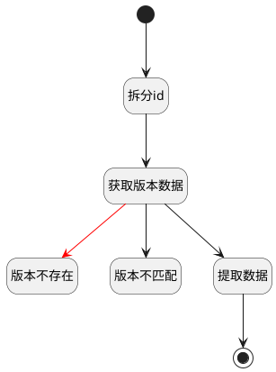

## 获取历史版本 <!-- {docsify-ignore-all} -->

   获取当前页面的历史版本记录

### 处理过程




### 处理步骤说明

#### 开始 :id=Begin<sup class="footnote-symbol"> <font color=gray size=1>[开始]</font></sup>


*- N/A*
#### 版本不存在 :id=THROWEXCEPTION1<sup class="footnote-symbol"> <font color=gray size=1>[抛出异常]</font></sup>


> [!ATTENTION|label:抛出异常|icon:fa fa-warning]
> 错误信息：版本不存在

#### 拆分id :id=RAWSFCODE1<sup class="footnote-symbol"> <font color=gray size=1>[直接后台代码]</font></sup>


<p class="panel-title"><b>执行代码[JavaScript]</b></p>

```javascript
var defaultObj = logic.getParam("default");
var versionObj = logic.getParam("version");
var id = defaultObj.get("id");
if(id != null && id != ''){
    if(id.contains("__SRFVERSION__")){
        var idArray = [];
        idArray = id.split("__SRFVERSION__");
        defaultObj.set("id",idArray[0]);
        versionObj.set("id",idArray[1]);
    }
}
```

#### 获取版本数据 :id=DEACTION1<sup class="footnote-symbol"> <font color=gray size=1>[实体行为]</font></sup>


调用实体 [版本(VERSION)](module/Base/version.md) 行为 [Get](module/Base/version#行为) ，行为参数为`version(版本)`

#### 版本不匹配 :id=THROWEXCEPTION2<sup class="footnote-symbol"> <font color=gray size=1>[抛出异常]</font></sup>


> [!ATTENTION|label:抛出异常|icon:fa fa-warning]
> 错误信息：版本不匹配

#### 提取数据 :id=PREPAREPARAM2<sup class="footnote-symbol"> <font color=gray size=1>[准备参数]</font></sup>


1. 将`version(版本).DATA(数据)` 绑定给  `Default(传入变量)`

#### 结束 :id=END1<sup class="footnote-symbol"> <font color=gray size=1>[结束]</font></sup>


返回 `Default(传入变量)`


### 连接条件说明
#### 版本不匹配 


### 实体逻辑参数

|    中文名   |    代码名    |  数据类型    |  实体   |备注 |
| --------| --------| -------- | -------- | --------   |
|传入变量(<i class="fa fa-check"/></i>)|Default|数据对象|[页面(PAGE)](module/Wiki/article_page.md)||
|版本|version|数据对象|[版本(VERSION)](module/Base/version.md)||
