## 获取草稿页面 <!-- {docsify-ignore-all} -->

   查询并返回草稿数据

### 处理过程

```plantuml
@startuml
hide empty description
<style>
root {
  HyperlinkColor #42b983
}
</style>

hide empty description
state "开始" as Begin <<start>> [[$./get_draft_pages#begin {"开始"}]]
state "返回查询结果" as END1 <<end>> [[$./get_draft_pages#end1 {"返回查询结果"}]]
state "查询草稿数据" as RAWSQLCALL1  [[$./get_draft_pages#rawsqlcall1 {"查询草稿数据"}]]


Begin --> RAWSQLCALL1
RAWSQLCALL1 --> END1


@enduml
```




### 处理步骤说明

#### 开始 :id=Begin<sup class="footnote-symbol"> <font color=gray size=1>[开始]</font></sup>


*- N/A*
#### 返回查询结果 :id=END1<sup class="footnote-symbol"> <font color=gray size=1>[结束]</font></sup>


返回 `page_list(页面列表)`

#### 查询草稿数据 :id=RAWSQLCALL1<sup class="footnote-symbol"> <font color=gray size=1>[直接SQL调用]</font></sup>


<p class="panel-title"><b>执行sql语句</b></p>

```sql
select * from page where page.SPACE_ID = ? and page.IS_PUBLISHED = 0;
```

<p class="panel-title"><b>执行sql参数</b></p>

1. `Default(传入变量).space_id(空间标识)`

重置参数`page_list(页面列表)`，并将执行sql结果赋值给参数`page_list(页面列表)`


### 实体逻辑参数

|    中文名   |    代码名    |  数据类型    |  实体   |备注 |
| --------| --------| -------- | -------- | --------   |
|传入变量(<i class="fa fa-check"/></i>)|Default|数据对象|[页面(PAGE)](module/Wiki/article_page.md)||
|过滤器|filter|过滤器|||
|页面列表|page_list|数据对象列表|[页面(PAGE)](module/Wiki/article_page.md)||
|页面分页结果|pages|分页查询|||
