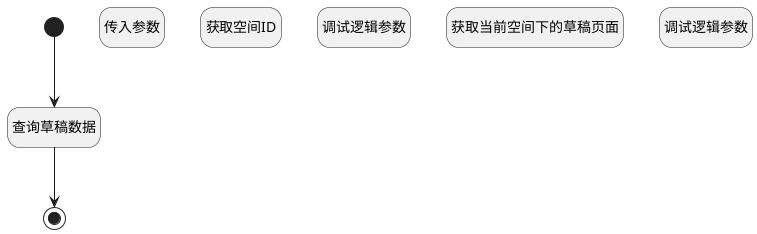

## 获取草稿页面 <!-- {docsify-ignore-all} -->

   查询并返回草稿数据

### 处理过程




### 处理步骤说明

#### 传入参数 :id=DEBUGPARAM1<sup class="footnote-symbol"> <font color=gray size=1>[调试逻辑参数]</font></sup>


> [!NOTE|label:调试信息|icon:fa fa-bug]
> 调试输出参数`Default(传入变量)`的详细信息


#### 获取空间ID :id=PREPAREPARAM1<sup class="footnote-symbol"> <font color=gray size=1>[准备参数]</font></sup>


1. 将`Default(传入变量).SPACE_ID(空间标识)` 设置给  `filter(过滤器).N_SPACE_ID_EQ`

#### 调试逻辑参数 :id=DEBUGPARAM2<sup class="footnote-symbol"> <font color=gray size=1>[调试逻辑参数]</font></sup>


> [!NOTE|label:调试信息|icon:fa fa-bug]
> 调试输出参数`filter(过滤器)`的详细信息


#### 获取当前空间下的草稿页面 :id=DEDATASET1<sup class="footnote-symbol"> <font color=gray size=1>[实体数据集]</font></sup>


调用实体 [页面(PAGE)](module/Wiki/article_page.md) 数据集合 [草稿页面(draft_page)](module/Wiki/article_page#数据集合) ，查询参数为`filter(过滤器)`

将执行结果返回给参数`pages(页面分页结果)`

#### 调试逻辑参数 :id=DEBUGPARAM3<sup class="footnote-symbol"> <font color=gray size=1>[调试逻辑参数]</font></sup>


> [!NOTE|label:调试信息|icon:fa fa-bug]
> 调试输出参数`pages(页面分页结果)`的详细信息


#### 开始 :id=Begin<sup class="footnote-symbol"> <font color=gray size=1>[开始]</font></sup>


*- N/A*
#### 返回查询结果 :id=END1<sup class="footnote-symbol"> <font color=gray size=1>[结束]</font></sup>


返回 `page_list(页面列表)`

#### 查询草稿数据 :id=RAWSQLCALL1<sup class="footnote-symbol"> <font color=gray size=1>[直接SQL调用]</font></sup>


<p class="panel-title"><b>执行sql语句</b></p>

```sql
select * from page where page.SPACE_ID = ? and page.IS_PUBLISHED = 0;
```

<p class="panel-title"><b>执行sql参数</b></p>

1. `Default(传入变量).space_id(空间标识)`

重置参数`page_list(页面列表)`，并将执行sql结果赋值给参数`page_list(页面列表)`


### 实体逻辑参数

|    中文名   |    代码名    |  数据类型    |  实体   |备注 |
| --------| --------| -------- | -------- | --------   |
|传入变量(<i class="fa fa-check"/></i>)|Default|数据对象|[页面(PAGE)](module/Wiki/article_page.md)||
|过滤器|filter|过滤器|||
|页面列表|page_list|数据对象列表|[页面(PAGE)](module/Wiki/article_page.md)||
|页面分页结果|pages|分页查询|||
