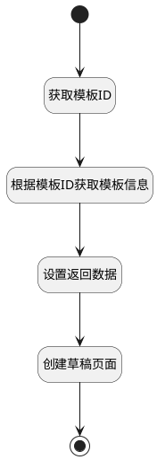

## 获取模板数据 <!-- {docsify-ignore-all} -->

   获取页面的模板数据，并返回

### 处理过程

### 处理步骤说明

#### 开始 :id=Begin [开始]

*- N/A*
#### 结束 :id=END1 [结束]

*- N/A*

#### 获取模板ID :id=PREPAREPARAM2 [准备参数]

1. 将`Default(传入变量).ID(标识)` 设置给  `stencil_info(模板信息).ID(标识)`

#### 根据模板ID获取模板信息 :id=DEACTION1 [实体行为]

调用实体 [页面模板(STENCIL)](module/Wiki/stencil.md) 行为 [Get](module/Wiki/stencil#行为) ，行为参数为`stencil_info(模板信息)`

将执行结果返回给参数`stencil_info(模板信息)`

#### 设置返回数据 :id=PREPAREPARAM1 [准备参数]

1. 将`stencil_info(模板信息).content(正文)` 设置给  `page_info(页面信息).content(正文)`
2. 将`1` 设置给  `page_info(页面信息).TYPE(类型)`
3. 将`stencil_info(模板信息).name(名称)` 设置给  `page_info(页面信息).Name(主题)`

#### 创建草稿页面 :id=DEACTION2 [实体行为]

调用实体 [页面(PAGE)](module/Wiki/article_page.md) 行为 [Create](module/Wiki/article_page#行为) ，行为参数为`page_info(页面信息)`

### 实体逻辑参数

|    中文名   |    代码名    |  数据类型    |  实体   |备注 |
| --------| --------| -------- | -------- | --------   |
|传入变量(<i class="fa fa-check"/></i>)|Default|数据对象|[页面(PAGE)](module/Wiki/article_page.md)||
|页面信息|page_info|数据对象|[页面(PAGE)](module/Wiki/article_page.md)||
|模板信息|stencil_info|数据对象|[页面模板(STENCIL)](module/Wiki/stencil.md)||
