## 获取共享信息 <!-- {docsify-ignore-all} -->

   页面共享设置表单，获取逻辑

### 处理过程

```plantuml
@startuml
hide empty description
<style>
root {
  HyperlinkColor #42b983
}
</style>

hide empty description
state "开始" as Begin <<start>> [[$./get_shared_info#begin {"开始"}]]
state "获取共享页面" as DEACTION1  [[$./get_shared_info#deaction1 {"获取共享页面"}]]
state "准备参数" as PREPAREPARAM1  [[$./get_shared_info#prepareparam1 {"准备参数"}]]
state "获取访问密码" as RAWSQLCALL1  [[$./get_shared_info#rawsqlcall1 {"获取访问密码"}]]
state "实体处理逻辑" as DELOGIC1  [[$./get_shared_info#delogic1 {"实体处理逻辑"}]]
state "准备参数" as PREPAREPARAM2  [[$./get_shared_info#prepareparam2 {"准备参数"}]]
state "结束" as END1 <<end>> [[$./get_shared_info#end1 {"结束"}]]


Begin --> DEACTION1
DEACTION1 --> PREPAREPARAM1
PREPAREPARAM1 --> RAWSQLCALL1
RAWSQLCALL1 --> DELOGIC1
DELOGIC1 --> PREPAREPARAM2
PREPAREPARAM2 --> END1


@enduml
```




### 处理步骤说明

#### 开始 :id=Begin<sup class="footnote-symbol"> <font color=gray size=1>[开始]</font></sup>


*- N/A*
#### 获取共享页面 :id=DEACTION1<sup class="footnote-symbol"> <font color=gray size=1>[实体行为]</font></sup>


调用实体 [页面(PAGE)](module/Wiki/article_page.md) 行为 [Get](module/Wiki/article_page#行为) ，行为参数为`Default(传入变量)`

将执行结果返回给参数`Default(传入变量)`

#### 准备参数 :id=PREPAREPARAM1<sup class="footnote-symbol"> <font color=gray size=1>[准备参数]</font></sup>


    无

#### 获取访问密码 :id=RAWSQLCALL1<sup class="footnote-symbol"> <font color=gray size=1>[直接SQL调用]</font></sup>


<p class="panel-title"><b>执行sql语句</b></p>

```sql
select `access_password` from `page` where `id` = ?
```

<p class="panel-title"><b>执行sql参数</b></p>

1. `Default(传入变量).ID(标识)`

重置参数`Default(传入变量)`，并将执行sql结果赋值给参数`Default(传入变量)`

#### 实体处理逻辑 :id=DELOGIC1<sup class="footnote-symbol"> <font color=gray size=1>[实体逻辑]</font></sup>


调用实体 [页面(PAGE)](module/Wiki/article_page.md) 处理逻辑 [访问密码解密]((module/Wiki/article_page/logic/decrypt_access_key.md)) ，行为参数为`Default(传入变量)`
将执行结果返回给参数`Default(传入变量)`

#### 准备参数 :id=PREPAREPARAM2<sup class="footnote-symbol"> <font color=gray size=1>[准备参数]</font></sup>


1. 将`Default(传入变量).ID(标识)` 设置给  `result(返回结果对象).ID(标识)`
2. 将`Default(传入变量).SHARED_BY(共享人)` 设置给  `result(返回结果对象).SHARED_BY(共享人)`
3. 将`Default(传入变量).SHARED_TIME(共享时间)` 设置给  `result(返回结果对象).SHARED_TIME(共享时间)`
4. 将`Default(传入变量).ACCESS_PASSWORD(访问密码)` 设置给  `result(返回结果对象).ACCESS_PASSWORD(访问密码)`
5. 将`Default(传入变量).IS_SHARED(是否开启共享)` 设置给  `result(返回结果对象).IS_SHARED(是否开启共享)`
6. 将`Default(传入变量).IS_SHARED_SUBSET(是否同时共享子页面)` 设置给  `result(返回结果对象).IS_SHARED_SUBSET(是否同时共享子页面)`
7. 将`Default(传入变量).EXPIRATION_DATE(共享有效期)` 设置给  `result(返回结果对象).EXPIRATION_DATE(共享有效期)`
8. 将`Default(传入变量).SPACE_ID(空间标识)` 设置给  `result(返回结果对象).SPACE_ID(空间标识)`
9. 将`Default(传入变量).NAME(主题)` 设置给  `Default(传入变量).NAME(主题)`
10. 将`Default(传入变量).PUBLISH_NAME(发布主题)` 设置给  `result(返回结果对象).PUBLISH_NAME(发布主题)`

#### 结束 :id=END1<sup class="footnote-symbol"> <font color=gray size=1>[结束]</font></sup>


返回 `result(返回结果对象)`


### 实体逻辑参数

|    中文名   |    代码名    |  数据类型    |  实体   |备注 |
| --------| --------| -------- | -------- | --------   |
|传入变量(<i class="fa fa-check"/></i>)|Default|数据对象|[页面(PAGE)](module/Wiki/article_page.md)||
|返回结果对象|result|数据对象|[页面(PAGE)](module/Wiki/article_page.md)||
