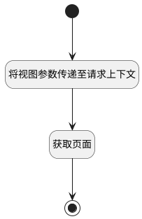

## 获取共享页面标题 <!-- {docsify-ignore-all} -->

   获取共享页面顶部标题

### 处理过程

### 处理步骤说明

#### 开始 :id=Begin [开始]

*- N/A*
#### 将视图参数传递至请求上下文 :id=PREPAREPARAM1 [准备参数]

1. 将`当前视图参数[shared_page] ==> ctx[article_page]` 设置给  `ctx(导航上下文变量).article_page`

#### 获取页面 :id=DEACTION1 [实体行为]

调用实体 [页面(PAGE)](module/Wiki/article_page.md) 行为 [Get](module/Wiki/article_page#行为) ，行为参数为`result(结果)`

将执行结果返回给参数`result(结果)`

#### 结束 :id=END1 [结束]

返回 `result(结果)`

### 实体逻辑参数

|    中文名   |    代码名    |  数据类型    |  实体   |备注 |
| --------| --------| -------- | -------- | --------   |
|传入变量(<i class="fa fa-check"/></i>)|Default|数据对象|[页面(PAGE)](module/Wiki/article_page.md)||
|导航上下文变量|ctx||||
|结果|result|数据对象|[页面(PAGE)](module/Wiki/article_page.md)||
