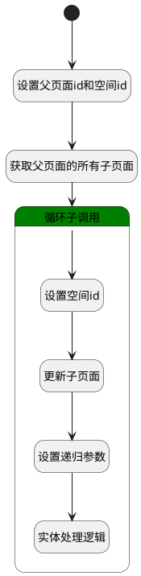

## 移动子页面 <!-- {docsify-ignore-all} -->

   移动子页面至知识空间

### 处理过程

### 处理步骤说明

#### 开始 :id=Begin [开始]

*- N/A*
#### 设置父页面id和空间id :id=PREPAREPARAM1 [准备参数]

1. 将`Default(传入变量).parent_id(父页面标识)` 绑定给  `parent_id(父页面id)`
2. 将`Default(传入变量).space_id(空间标识)` 绑定给  `space_id(空间id)`
3. 将`Default(传入变量).parent_id(父页面标识)` 设置给  `page_filter(过滤器).N_PARENT_ID_EQ`

#### 获取父页面的所有子页面 :id=DEDATASET1 [实体数据集]

调用实体 [页面(PAGE)](module/Wiki/article_page.md) 数据集合 [正常(normal)](module/Wiki/article_page#数据集合) ，查询参数为`page_filter(过滤器)`

将执行结果返回给参数`move_pages(子页面数据)`

#### 循环子调用 :id=LOOPSUBCALL1 [循环子调用]

循环参数`move_pages(子页面数据)`，子循环参数使用`for_tmp_obj(循环变量)`
#### 设置空间id :id=PREPAREPARAM2 [准备参数]

1. 将`space_id(空间id)` 设置给  `for_tmp_obj(循环变量).SPACE_ID(空间标识)`
2. 将` ==> for_tmp_obj[IDENTIFIER]` 设置给  `for_tmp_obj(循环变量).IDENTIFIER(编号)`

#### 更新子页面 :id=DEACTION1 [实体行为]

调用实体 [页面(PAGE)](module/Wiki/article_page.md) 行为 [Update](module/Wiki/article_page#行为) ，行为参数为`for_tmp_obj(循环变量)`

#### 设置递归参数 :id=PREPAREPARAM3 [准备参数]

1. 将`for_tmp_obj(循环变量).ID(标识)` 设置给  `child_data(子页面参数).parent_id`
2. 将`space_id(空间id)` 设置给  `child_data(子页面参数).space_id`

#### 实体处理逻辑 :id=DELOGIC1 [实体逻辑]

调用实体 [页面(PAGE)](module/Wiki/article_page.md) 处理逻辑 [移动子页面]((module/Wiki/article_page/logic/move_child_page.md)) ，行为参数为`child_data(子页面参数)`

### 实体逻辑参数

|    中文名   |    代码名    |  数据类型    |  实体   |备注 |
| --------| --------| -------- | -------- | --------   |
|传入变量(<i class="fa fa-check"/></i>)|Default|数据对象|[页面(PAGE)](module/Wiki/article_page.md)||
|子页面参数|child_data|数据对象|||
|循环变量|for_tmp_obj|数据对象|[页面(PAGE)](module/Wiki/article_page.md)||
|子页面数据|move_pages|分页查询|||
|过滤器|page_filter|过滤器|||
|父页面id|parent_id|简单数据|||
|空间id|space_id|简单数据|||
