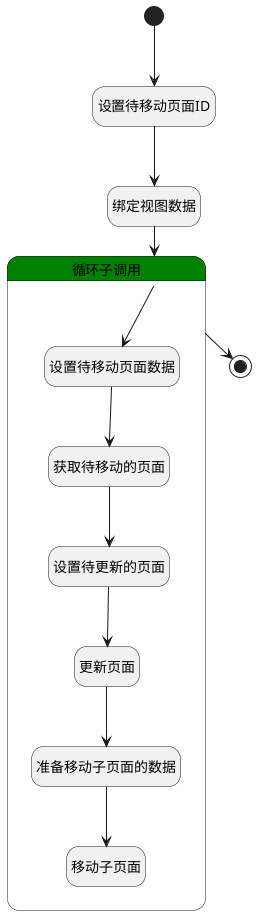

## 移动页面 <!-- {docsify-ignore-all} -->

   移动页面至知识空间

### 处理过程

### 处理步骤说明

#### 开始 :id=Begin [开始]

*- N/A*
#### 设置待移动页面ID :id=PREPAREPARAM1 [准备参数]

1. 将`Default(传入变量).id(标识)` 绑定给  `page_id(待移动页面id)`

#### 绑定视图数据 :id=BINDPARAM1 [绑定参数]

绑定参数`Default(传入变量)` 到 `srfactionparam(视图数据)`
#### 循环子调用 :id=LOOPSUBCALL1 [循环子调用]

循环参数`srfactionparam(视图数据)`，子循环参数使用`for_tmp_obj(循环变量)`
#### 设置待移动页面数据 :id=PREPAREPARAM2 [准备参数]

1. 将`for_tmp_obj(循环变量).parent_id(父页面标识)` 绑定给  `target_page_id(目标页面id)`
2. 将`for_tmp_obj(循环变量).space_id(空间标识)` 绑定给  `target_space_id(目标空间id)`

#### 获取待移动的页面 :id=DEACTION1 [实体行为]

调用实体 [页面(PAGE)](module/Wiki/article_page.md) 行为 [Get](module/Wiki/article_page#行为) ，行为参数为`page_id(待移动页面id)`

将执行结果返回给参数`page_obj(页面对象)`

#### 设置待更新的页面 :id=PREPAREPARAM3 [准备参数]

1. 将`target_space_id(目标空间id)` 设置给  `page_obj(页面对象).SPACE_ID(空间标识)`
2. 将` ==> page_obj[IDENTIFIER]` 设置给  `page_obj(页面对象).IDENTIFIER(编号)`
3. 将`空值（NULL）` 设置给  `page_obj(页面对象).CATEGORIES(类别路径)`
4. 将`target_page_id(目标页面id)` 设置给  `page_obj(页面对象).PARENT_ID(父页面标识)`

#### 更新页面 :id=DEACTION2 [实体行为]

调用实体 [页面(PAGE)](module/Wiki/article_page.md) 行为 [Save](module/Wiki/article_page#行为) ，行为参数为`page_obj(页面对象)`

将执行结果返回给参数`page_obj(页面对象)`

#### 准备移动子页面的数据 :id=PREPAREPARAM4 [准备参数]

1. 将`page_obj(页面对象).ID(标识)` 设置给  `child_data(子页面移动参数).parent_id`
2. 将`target_space_id(目标空间id)` 设置给  `child_data(子页面移动参数).space_id`

#### 移动子页面 :id=DELOGIC1 [实体逻辑]

调用实体 [页面(PAGE)](module/Wiki/article_page.md) 处理逻辑 [移动子页面]((module/Wiki/article_page/logic/move_child_page.md)) ，行为参数为`child_data(子页面移动参数)`

#### 结束 :id=END1 [结束]

*- N/A*

### 实体逻辑参数

|    中文名   |    代码名    |  数据类型    |  实体   |备注 |
| --------| --------| -------- | -------- | --------   |
|传入变量(<i class="fa fa-check"/></i>)|Default|数据对象|[页面(PAGE)](module/Wiki/article_page.md)||
|附件|attachment|数据对象|[附件(ATTACHMENT)](module/Base/attachment.md)||
|附件|attachments|数据对象列表|[附件(ATTACHMENT)](module/Base/attachment.md)||
|子页面移动参数|child_data|数据对象|||
|循环变量|for_tmp_obj|数据对象|[页面(PAGE)](module/Wiki/article_page.md)||
|待移动页面id|page_id|简单数据|||
|页面对象|page_obj|数据对象|[页面(PAGE)](module/Wiki/article_page.md)||
|视图数据|srfactionparam|数据对象列表|||
|目标页面id|target_page_id|简单数据|||
|目标空间id|target_space_id|简单数据|||
