## 发布名称 <!-- {docsify-ignore-all} -->

   页面树更新发布名称，同步更新名称

### 处理过程

```plantuml
@startuml
hide empty description
<style>
root {
  HyperlinkColor #42b983
}
</style>

hide empty description
state "开始" as Begin <<start>> [[$./publish_name#begin {"开始"}]]
state "发布名称赋值" as PREPAREPARAM_01  [[$./publish_name#prepareparam_01 {"发布名称赋值"}]]
state "更新页面名称" as DEACTION_01  [[$./publish_name#deaction_01 {"更新页面名称"}]]
state "结束" as END_01 <<end>> [[$./publish_name#end_01 {"结束"}]]


Begin --> PREPAREPARAM_01
PREPAREPARAM_01 --> DEACTION_01
DEACTION_01 --> END_01


@enduml
```

### 处理步骤说明

#### 开始 :id=Begin [开始]

*- N/A*
#### 发布名称赋值 :id=PREPAREPARAM_01 [准备参数]

1. 将`Default(传入变量).PUBLISH_NAME(发布主题)` 设置给  `Default(传入变量).NAME(主题)`

#### 更新页面名称 :id=DEACTION_01 [实体行为]

调用实体 [页面(PAGE)](module/Wiki/article_page.md) 行为 [Update](module/Wiki/article_page#行为) ，行为参数为`Default(传入变量)`

将执行结果返回给参数`Default(传入变量)`

#### 结束 :id=END_01 [结束]

返回 `Default(传入变量)`

### 实体逻辑参数

|    中文名   |    代码名    |  数据类型    |  实体   |备注 |
| --------| --------| -------- | -------- | --------   |
|传入变量(<i class="fa fa-check"/></i>)|Default|数据对象|[页面(PAGE)](module/Wiki/article_page.md)||
