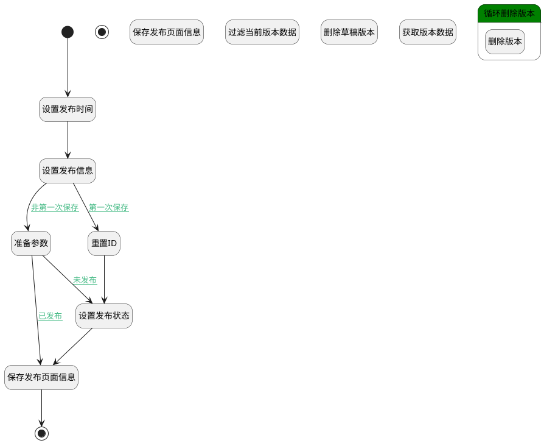

## 发布页面 <!-- {docsify-ignore-all} -->

   页面发布，设置发布状态及发布人，发布时间

### 处理过程




### 处理步骤说明

#### 开始 :id=Begin<sup class="footnote-symbol"> <font color=gray size=1>[开始]</font></sup>


*- N/A*
#### 结束 :id=END1<sup class="footnote-symbol"> <font color=gray size=1>[结束]</font></sup>


返回 `Default(传入变量)`

#### 设置发布时间 :id=RAWSFCODE1<sup class="footnote-symbol"> <font color=gray size=1>[直接后台代码]</font></sup>


<p class="panel-title"><b>执行代码[JavaScript]</b></p>

```javascript
var defaultObj = logic.getParam("default");
defaultObj.set("publish_time", new Date());
```

#### 设置发布信息 :id=PREPAREPARAM1<sup class="footnote-symbol"> <font color=gray size=1>[准备参数]</font></sup>

设置发布人、发布内容

1. 将`Default(传入变量).CONTENT(正文)` 设置给  `Default(传入变量).PUBLISH_CONTENT(发布正文)`
2. 将`Default(传入变量).NAME(主题)` 设置给  `Default(传入变量).PUBLISH_NAME(发布主题)`
3. 将`用户全局对象.srfpersonid` 设置给  `Default(传入变量).PUBLISH_MAN(发布人)`

#### 准备参数 :id=PREPAREPARAM5<sup class="footnote-symbol"> <font color=gray size=1>[准备参数]</font></sup>


    无

#### 保存发布页面信息 :id=DEACTION1<sup class="footnote-symbol"> <font color=gray size=1>[实体行为]</font></sup>


调用实体 [页面(PAGE)](module/Wiki/article_page.md) 行为 [Save](module/Wiki/article_page#行为) ，行为参数为`Default(传入变量)`

将执行结果返回给参数`Default(传入变量)`

#### 重置ID :id=PREPAREPARAM4<sup class="footnote-symbol"> <font color=gray size=1>[准备参数]</font></sup>


1. 将`空值（NULL）` 设置给  `Default(传入变量).ID(标识)`

#### 设置发布状态 :id=PREPAREPARAM2<sup class="footnote-symbol"> <font color=gray size=1>[准备参数]</font></sup>


1. 将`1` 设置给  `Default(传入变量).IS_PUBLISHED(是否发布)`
2. 将`1` 设置给  `Default(传入变量).PUBLISHED(发布状态)`

#### 保存发布页面信息 :id=DEACTION2<sup class="footnote-symbol"> <font color=gray size=1>[实体行为]</font></sup>


调用实体 [页面(PAGE)](module/Wiki/article_page.md) 行为 [Save](module/Wiki/article_page#行为) ，行为参数为`Default(传入变量)`

#### 结束 :id=END2<sup class="footnote-symbol"> <font color=gray size=1>[结束]</font></sup>


返回 `Default(传入变量)`

#### 过滤当前版本数据 :id=PREPAREPARAM3<sup class="footnote-symbol"> <font color=gray size=1>[准备参数]</font></sup>


1. 将`Default(传入变量).ID(标识)` 设置给  `version_filter(版本过滤器).n_owner_id_eq`
2. 将`PAGE` 设置给  `version_filter(版本过滤器).n_owner_type_eq`

#### 删除草稿版本 :id=RAWSQLCALL1<sup class="footnote-symbol"> <font color=gray size=1>[直接SQL调用]</font></sup>


<p class="panel-title"><b>执行sql语句</b></p>

```sql
DELETE
FROM version  where OWNER_ID = ?  and JSON_EXTRACT(data, '$.is_published') = 0  and OWNER_TYPE = 'PAGE' ORDER BY name desc;
```

<p class="panel-title"><b>执行sql参数</b></p>

1. `Default(传入变量).ID(标识)`


#### 获取版本数据 :id=DEDATASET1<sup class="footnote-symbol"> <font color=gray size=1>[实体数据集]</font></sup>


调用实体 [版本(VERSION)](module/Base/version.md) 数据集合 [数据集(DEFAULT)](module/Base/version#数据集合) ，查询参数为`version_filter(版本过滤器)`

将执行结果返回给参数`version_pages(版本分页查询结果)`

#### 循环删除版本 :id=LOOPSUBCALL1<sup class="footnote-symbol"> <font color=gray size=1>[循环子调用]</font></sup>


循环参数`version_pages(版本分页查询结果)`，子循环参数使用`version_temp(版本临时变量)`
#### 删除版本 :id=DEACTION3<sup class="footnote-symbol"> <font color=gray size=1>[实体行为]</font></sup>


调用实体 [版本(VERSION)](module/Base/version.md) 行为 [Remove](module/Base/version#行为) ，行为参数为`version_temp(版本临时变量)`


### 连接条件说明
#### 第一次保存 :id=PREPAREPARAM1-PREPAREPARAM4

(`Default(传入变量).ID(标识)` EQ `undefined` OR `Default(传入变量).ID(标识)` ISNULL)
#### 非第一次保存 :id=PREPAREPARAM1-PREPAREPARAM5

`Default(传入变量).ID(标识)` ISNOTNULL AND `Default(传入变量).ID(标识)` NOTEQ `undefined`
#### 已发布 :id=PREPAREPARAM5-DEACTION2

`Default(传入变量).IS_PUBLISHED(是否发布)` EQ `1` AND `Default(传入变量).published(发布状态)` EQ `1`
#### 未发布 :id=PREPAREPARAM5-PREPAREPARAM2

(`Default(传入变量).IS_PUBLISHED(是否发布)` EQ `0` OR `Default(传入变量).PUBLISHED(发布状态)` EQ `0` OR `Default(传入变量).PUBLISHED(发布状态)` ISNULL)


### 实体逻辑参数

|    中文名   |    代码名    |  数据类型    |  实体   |备注 |
| --------| --------| -------- | -------- | --------   |
|传入变量(<i class="fa fa-check"/></i>)|Default|数据对象|[页面(PAGE)](module/Wiki/article_page.md)||
|过滤器|filter|过滤器|||
|版本过滤器|version_filter|过滤器|||
|版本分页查询结果|version_pages|分页查询|||
|版本临时变量|version_temp|数据对象|[版本(VERSION)](module/Base/version.md)||
