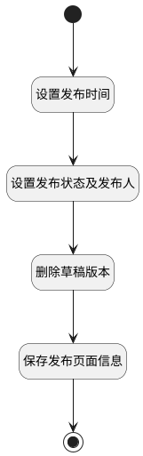

## 发布页面（测试） <!-- {docsify-ignore-all} -->

   （测试）页面发布，设置发布状态及发布人，发布时间

### 处理过程




### 处理步骤说明

#### 开始 :id=Begin<sup class="footnote-symbol"> <font color=gray size=1>[开始]</font></sup>


*- N/A*
#### 结束 :id=END1<sup class="footnote-symbol"> <font color=gray size=1>[结束]</font></sup>


返回 `Default(传入变量)`

#### 设置发布时间 :id=RAWSFCODE1<sup class="footnote-symbol"> <font color=gray size=1>[直接后台代码]</font></sup>


<p class="panel-title"><b>执行代码[JavaScript]</b></p>

```javascript
var defaultObj = logic.getParam("default");
defaultObj.set("publish_time", new Date());
```

#### 设置发布状态及发布人 :id=PREPAREPARAM1<sup class="footnote-symbol"> <font color=gray size=1>[准备参数]</font></sup>


1. 将`1` 设置给  `Default(传入变量).IS_PUBLISHED(是否发布)`
2. 将`用户全局对象.srfpersonid` 设置给  `Default(传入变量).PUBLISH_MAN(发布人)`

#### 删除草稿版本 :id=RAWSQLCALL1<sup class="footnote-symbol"> <font color=gray size=1>[直接SQL调用]</font></sup>


<p class="panel-title"><b>执行sql语句</b></p>

```sql
DELETE
FROM version  where OWNER_ID = ?  and JSON_EXTRACT(data, '$.is_published') = 0  and OWNER_TYPE = 'PAGE' ORDER BY name desc;
```

<p class="panel-title"><b>执行sql参数</b></p>

1. `Default(传入变量).ID(标识)`


#### 保存发布页面信息 :id=DEACTION1<sup class="footnote-symbol"> <font color=gray size=1>[实体行为]</font></sup>


调用实体 [页面(PAGE)](module/Wiki/article_page.md) 行为 [Save](module/Wiki/article_page#行为) ，行为参数为`Default(传入变量)`

将执行结果返回给参数`Default(传入变量)`


### 实体逻辑参数

|    中文名   |    代码名    |  数据类型    |  实体   |备注 |
| --------| --------| -------- | -------- | --------   |
|传入变量(<i class="fa fa-check"/></i>)|Default|数据对象|[页面(PAGE)](module/Wiki/article_page.md)||
|过滤器|filter|过滤器|||
|版本分页查询结果|version_pages|分页查询|||
