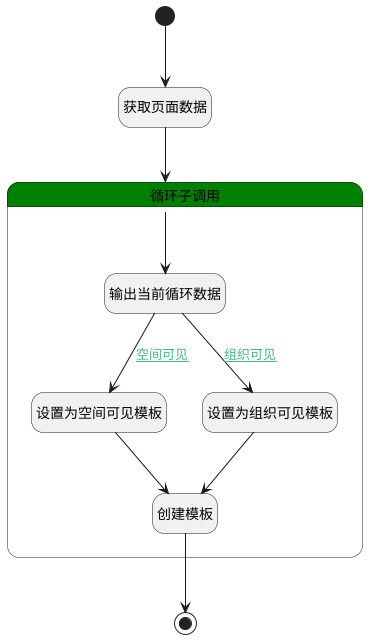

## 另存为模板 <!-- {docsify-ignore-all} -->

   将当前页面存为组织/空间模板

### 处理过程

### 处理步骤说明

#### 设置为空间可见模板 :id=PREPAREPARAM2 [准备参数]

1. 将`for_temp_obj(循环临时变量).name` 设置给  `stencil_info(模板信息).NAME(名称)`
2. 将`Default(传入变量).FORMAT_TYPE(正文格式)` 设置给  `stencil_info(模板信息).FORMAT_TYPE(正文格式)`
3. 将`Default(传入变量).CONTENT(正文)` 设置给  `stencil_info(模板信息).CONTENT(正文)`
4. 将`Default(传入变量).SPACE_ID(空间标识)` 设置给  `stencil_info(模板信息).SPACE_ID(空间标识)`

#### 结束 :id=END1 [结束]

*- N/A*

#### 创建模板 :id=DEACTION1 [实体行为]

调用实体 [页面模板(STENCIL)](module/Wiki/stencil.md) 行为 [Create](module/Wiki/stencil#行为) ，行为参数为`stencil_info(模板信息)`

#### 开始 :id=Begin [开始]

*- N/A*
#### 获取页面数据 :id=PREPAREPARAM1 [准备参数]

1. 将`Default(传入变量).srfactionparam` 绑定给  `srfactionparam(表单数据)`

#### 循环子调用 :id=LOOPSUBCALL1 [循环子调用]

循环参数`srfactionparam(表单数据)`，子循环参数使用`for_temp_obj(循环临时变量)`
#### 输出当前循环数据 :id=DEBUGPARAM2 [调试逻辑参数]

> [!NOTE|label:调试信息|icon:fa fa-bug]
> 调试输出参数`for_temp_obj(循环临时变量)`的详细信息

#### 设置为组织可见模板 :id=PREPAREPARAM3 [准备参数]

1. 将`for_temp_obj(循环临时变量).name` 设置给  `stencil_info(模板信息).NAME(名称)`
2. 将`Default(传入变量).FORMAT_TYPE(正文格式)` 设置给  `stencil_info(模板信息).FORMAT_TYPE(正文格式)`
3. 将`Default(传入变量).CONTENT(正文)` 设置给  `stencil_info(模板信息).CONTENT(正文)`

### 连接条件说明
#### 空间可见 :id=DEBUGPARAM2-PREPAREPARAM2

`for_temp_obj(循环临时变量).stencil_scope` EQ `space_stencil`
#### 组织可见 :id=DEBUGPARAM2-PREPAREPARAM3

`for_temp_obj(循环临时变量).stencil_scope` EQ `org_stencil`

### 实体逻辑参数

|    中文名   |    代码名    |  数据类型    |  实体   |备注 |
| --------| --------| -------- | -------- | --------   |
|传入变量(<i class="fa fa-check"/></i>)|Default|数据对象|[页面(PAGE)](module/Wiki/article_page.md)||
|循环临时变量|for_temp_obj|数据对象|||
|表单数据|srfactionparam|数据对象列表|||
|模板信息|stencil_info|数据对象|[页面模板(STENCIL)](module/Wiki/stencil.md)||
