## 保存命名版本 <!-- {docsify-ignore-all} -->

   设置命名版本：新建命名版本并保存

### 处理过程

```plantuml
@startuml
hide empty description
<style>
root {
  HyperlinkColor #42b983
}
</style>

hide empty description
state "开始" as Begin <<start>> [[$./set_name_version#begin {"开始"}]]
state "结束" as END1 <<end>> [[$./set_name_version#end1 {"结束"}]]
state "获取操作表单数据" as PREPAREPARAM2  [[$./set_name_version#prepareparam2 {"获取操作表单数据"}]]
state "版本数据" as PREPAREPARAM3  [[$./set_name_version#prepareparam3 {"版本数据"}]]
state "更新版本数据" as DEACTION2  [[$./set_name_version#deaction2 {"更新版本数据"}]]


Begin --> PREPAREPARAM2
PREPAREPARAM2 --> PREPAREPARAM3
PREPAREPARAM3 --> DEACTION2
DEACTION2 --> END1


@enduml
```

### 处理步骤说明

#### 开始 :id=Begin [开始]

*- N/A*
#### 结束 :id=END1 [结束]

*- N/A*

#### 获取操作表单数据 :id=PREPAREPARAM2 [准备参数]

1. 将`Default(传入变量).srfactionparam` 绑定给  `srfactionparam`
2. 将`srfactionparam.0` 绑定给  `form_data(表单数据)`

#### 版本数据 :id=PREPAREPARAM3 [准备参数]

1. 将`form_data(表单数据).version_id` 设置给  `version(版本).ID(标识)`
2. 将`form_data(表单数据).version_name` 设置给  `version(版本).NAME(名称)`
3. 将`1` 设置给  `version(版本).IS_NAMED(是否命名)`

#### 更新版本数据 :id=DEACTION2 [实体行为]

调用实体 [版本(VERSION)](module/Base/version.md) 行为 [Update](module/Base/version#行为) ，行为参数为`version(版本)`

### 实体逻辑参数

|    中文名   |    代码名    |  数据类型    |  实体   |备注 |
| --------| --------| -------- | -------- | --------   |
|传入变量(<i class="fa fa-check"/></i>)|Default|数据对象|[页面(PAGE)](module/Wiki/article_page.md)||
|表单数据|form_data|数据对象|||
|页面详情|page_detail|数据对象|[页面(PAGE)](module/Wiki/article_page.md)||
|srfactionparam|srfactionparam|数据对象列表|||
|版本|version|数据对象|[版本(VERSION)](module/Base/version.md)||
