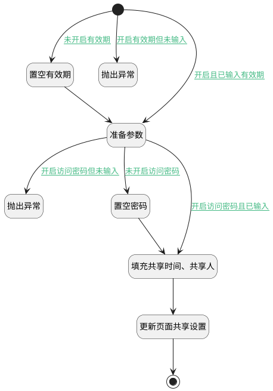

## 共享设置 <!-- {docsify-ignore-all} -->

   共享设置

### 处理过程




### 处理步骤说明

#### 开始 :id=Begin<sup class="footnote-symbol"> <font color=gray size=1>[开始]</font></sup>


*- N/A*
#### 置空有效期 :id=PREPAREPARAM1<sup class="footnote-symbol"> <font color=gray size=1>[准备参数]</font></sup>


1. 将`空值（NULL）` 设置给  `Default(传入变量).EXPIRATION_DATE(共享有效期)`

#### 抛出异常 :id=THROWEXCEPTION1<sup class="footnote-symbol"> <font color=gray size=1>[抛出异常]</font></sup>


> [!ATTENTION|label:抛出异常|icon:fa fa-warning]
> 错误信息：未设置有效期！

#### 准备参数 :id=PREPAREPARAM2<sup class="footnote-symbol"> <font color=gray size=1>[准备参数]</font></sup>


1. 将`1` 设置给  `Default(传入变量).IS_SHARED(是否开启共享)`

#### 抛出异常 :id=THROWEXCEPTION2<sup class="footnote-symbol"> <font color=gray size=1>[抛出异常]</font></sup>


> [!ATTENTION|label:抛出异常|icon:fa fa-warning]
> 错误信息：未设置访问密码！

#### 置空密码 :id=PREPAREPARAM3<sup class="footnote-symbol"> <font color=gray size=1>[准备参数]</font></sup>


1. 将`空值（NULL）` 设置给  `Default(传入变量).ACCESS_PASSWORD(访问密码)`

#### 填充共享时间、共享人 :id=RAWSFCODE1<sup class="footnote-symbol"> <font color=gray size=1>[直接后台代码]</font></sup>


<p class="panel-title"><b>执行代码[Groovy]</b></p>

```groovy
def _default = logic.param('Default').getReal()
if(_default.get('shared_by') == null){
    _default.set('shared_by', sys.user.getUserid())
}
if(_default.get('shared_time') == null){
    _default.set('shared_time', new java.sql.Timestamp(System.currentTimeMillis()))
}
```

#### 更新页面共享设置 :id=DEACTION1<sup class="footnote-symbol"> <font color=gray size=1>[实体行为]</font></sup>


调用实体 [页面(PAGE)](module/Wiki/article_page.md) 行为 [Update](module/Wiki/article_page#行为) ，行为参数为`Default(传入变量)`

将执行结果返回给参数`Default(传入变量)`

#### 结束 :id=END1<sup class="footnote-symbol"> <font color=gray size=1>[结束]</font></sup>


*- N/A*


### 连接条件说明
#### 未开启有效期 :id=Begin-PREPAREPARAM1

`Default(传入变量).enable_expiration` EQ `0`
#### 未开启访问密码 :id=PREPAREPARAM2-PREPAREPARAM3

`Default(传入变量).enable_password` EQ `0`
#### 开启访问密码且已输入 :id=PREPAREPARAM2-RAWSFCODE1

`Default(传入变量).enable_password` EQ `1` AND `Default(传入变量).ACCESS_PASSWORD(访问密码)` ISNOTNULL
#### 开启访问密码但未输入 :id=PREPAREPARAM2-THROWEXCEPTION2

`Default(传入变量).enable_password` EQ `1` AND `Default(传入变量).ACCESS_PASSWORD(访问密码)` ISNULL
#### 开启且已输入有效期 :id=Begin-PREPAREPARAM2

`Default(传入变量).EXPIRATION_DATE(共享有效期)` ISNOTNULL AND `Default(传入变量).enable_expiration` EQ `1`
#### 开启有效期但未输入 :id=Begin-THROWEXCEPTION1

`Default(传入变量).enable_expiration` EQ `1` AND `Default(传入变量).EXPIRATION_DATE(共享有效期)` ISNULL


### 实体逻辑参数

|    中文名   |    代码名    |  数据类型    |  实体   |备注 |
| --------| --------| -------- | -------- | --------   |
|传入变量(<i class="fa fa-check"/></i>)|Default|数据对象|[页面(PAGE)](module/Wiki/article_page.md)||
