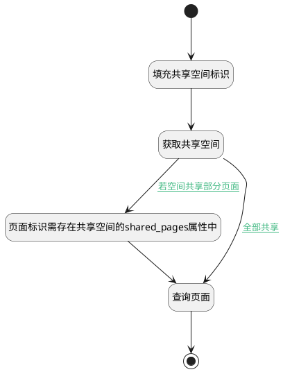

## 查询空间下的共享页面 <!-- {docsify-ignore-all} -->

   查询空间下的共享页面，通过父级标识查询子页面

### 处理过程

### 处理步骤说明

#### 开始 :id=Begin [开始]

*- N/A*
#### 填充共享空间标识 :id=PREPAREPARAM1 [准备参数]

1. 将`Default(传入变量).shared_space` 设置给  `shared_space(共享空间).ID(标识)`

#### 获取共享空间 :id=DEACTION1 [实体行为]

调用实体 [共享空间(SHARED_SPACE)](module/Wiki/shared_space.md) 行为 [Get](module/Wiki/shared_space#行为) ，行为参数为`shared_space(共享空间)`

将执行结果返回给参数`shared_space(共享空间)`

#### 页面标识需存在共享空间的shared_pages属性中 :id=PREPAREPARAM2 [准备参数]

1. 将`shared_space(共享空间).SHARED_PAGES(共享页面标识)` 设置给  `Default(传入变量).n_id_in`

#### 查询页面 :id=DEDATASET1 [实体数据集]

调用实体 [页面(PAGE)](module/Wiki/article_page.md) 数据集合 [正常(normal)](module/Wiki/article_page#数据集合) ，查询参数为`Default(传入变量)`

将执行结果返回给参数`result_page(返回查询结果分页变量)`

#### 结束 :id=END1 [结束]

返回 `result_page(返回查询结果分页变量)`

### 连接条件说明
#### 若空间共享部分页面 :id=DEACTION1-PREPAREPARAM2

`shared_space(共享空间).IS_SHARED(是否开启共享)` EQ `2`
#### 全部共享 :id=DEACTION1-DEDATASET1

`shared_space(共享空间).IS_SHARED(是否开启共享)` EQ `1`

### 实体逻辑参数

|    中文名   |    代码名    |  数据类型    |  实体   |备注 |
| --------| --------| -------- | -------- | --------   |
|传入变量(<i class="fa fa-check"/></i>)|Default|过滤器|||
|返回查询结果分页变量|result_page|分页查询|||
|共享空间|shared_space|数据对象|[共享空间(SHARED_SPACE)](module/Wiki/shared_space.md)||
