## 同步发布名称与名称 <!-- {docsify-ignore-all} -->

   同步发布名称与名称

### 处理过程

```plantuml
@startuml
hide empty description
<style>
root {
  HyperlinkColor #42b983
}
</style>

hide empty description
state "开始" as Begin <<start>> [[$./sync_name#begin {"开始"}]]
state "结束" as END1 <<end>> [[$./sync_name#end1 {"结束"}]]
state "准备参数" as PREPAREPARAM1  [[$./sync_name#prepareparam1 {"准备参数"}]]


Begin --> PREPAREPARAM1 : [[$./sync_name#begin-prepareparam1{连接名称} 连接名称]]
PREPAREPARAM1 --> END1


@enduml
```

### 处理步骤说明

#### 开始 :id=Begin [开始]

*- N/A*
#### 结束 :id=END1 [结束]

*- N/A*

#### 准备参数 :id=PREPAREPARAM1 [准备参数]

1. 将`Default(传入变量).NAME(主题)` 设置给  `Default(传入变量).PUBLISH_NAME(发布主题)`

### 连接条件说明
#### 连接名称 :id=Begin-PREPAREPARAM1

`Default(传入变量).TYPE(类型)` EQ `2`

### 实体逻辑参数

|    中文名   |    代码名    |  数据类型    |  实体   |备注 |
| --------| --------| -------- | -------- | --------   |
|传入变量(<i class="fa fa-check"/></i>)|Default|数据对象|[页面(PAGE)](module/Wiki/article_page.md)||
