## 解锁页面 <!-- {docsify-ignore-all} -->

   修改页面的is_lock字段

### 处理过程

```plantuml
@startuml
hide empty description
<style>
root {
  HyperlinkColor #42b983
}
</style>

hide empty description
state "开始" as Begin <<start>> [[$./unlock_page#begin {"开始"}]]
state "设置主键" as PREPAREPARAM1  [[$./unlock_page#prepareparam1 {"设置主键"}]]
state "获取页面数据" as DEACTION1  [[$./unlock_page#deaction1 {"获取页面数据"}]]
state "设置is_lock字段" as PREPAREPARAM2  [[$./unlock_page#prepareparam2 {"设置is_lock字段"}]]
state "更新页面" as DEACTION2  [[$./unlock_page#deaction2 {"更新页面"}]]


Begin --> PREPAREPARAM1
PREPAREPARAM1 --> DEACTION1
DEACTION1 --> PREPAREPARAM2
PREPAREPARAM2 --> DEACTION2


@enduml
```

### 处理步骤说明

#### 开始 :id=Begin [开始]

*- N/A*
#### 设置主键 :id=PREPAREPARAM1 [准备参数]

1. 将`Default(传入变量).ID(标识)` 绑定给  `page_id(页面id)`

#### 获取页面数据 :id=DEACTION1 [实体行为]

调用实体 [页面(PAGE)](module/Wiki/article_page.md) 行为 [Get](module/Wiki/article_page#行为) ，行为参数为`page_id(页面id)`

将执行结果返回给参数`page_obj(页面实体)`

#### 设置is_lock字段 :id=PREPAREPARAM2 [准备参数]

1. 将`0` 设置给  `page_obj(页面实体).IS_LOCK(是否锁定)`

#### 更新页面 :id=DEACTION2 [实体行为]

调用实体 [页面(PAGE)](module/Wiki/article_page.md) 行为 [Update](module/Wiki/article_page#行为) ，行为参数为`page_obj(页面实体)`

### 实体逻辑参数

|    中文名   |    代码名    |  数据类型    |  实体   |备注 |
| --------| --------| -------- | -------- | --------   |
|传入变量(<i class="fa fa-check"/></i>)|Default|数据对象|[页面(PAGE)](module/Wiki/article_page.md)||
|页面id|page_id|简单数据|||
|页面实体|page_obj|数据对象|[页面(PAGE)](module/Wiki/article_page.md)||
